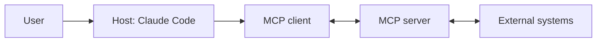

# Domain 4: Tool Design & MCP Integration (18%)

## Executive Summary

In the Claude ecosystem, **MCP means Model Context Protocol**: an open standard for connecting AI applications to external tools, data sources, and workflows. It does **not** mean "managed control plane."

This exam domain combines two tightly related skills:

- designing tools Claude can call reliably
- integrating external capabilities through MCP servers in Claude Code or other hosts

The core idea is simple: Claude is strongest when tools are easy to choose, easy to call, easy to validate, and safe to operate.

## Tool Use Fundamentals on Claude

Claude can work with several kinds of tools:

| Capability type | Where it runs | Typical examples | Who executes it |
|---|---|---|---|
| Client tools | Your application | internal APIs, database adapters, workflow tools | You |
| Anthropic server tools | Anthropic infrastructure | `web_search`, `code_execution`, `web_fetch`, `tool_search` (depending on surface/model) | Anthropic |
| MCP tools | MCP server connected to a host such as Claude Code | GitHub, Slack, Notion, PostgreSQL, Sentry, custom internal systems | The MCP server |

### The `tool_use` / `tool_result` contract

For client-side tool use in the Messages API:

1. You define tools with a `name`, `description`, and `input_schema`.
2. Claude decides to use one and returns `stop_reason: "tool_use"` plus one or more `tool_use` blocks.
3. Each `tool_use` block includes an `id`, `name`, and `input` object.
4. Your application executes the tool.
5. You send back a `tool_result` block that references the original `tool_use_id`.

That `tool_use_id` is the join key between Claude's intent and your execution layer.

### Tool choice modes

Claude supports these `tool_choice` modes:

- `auto`: Claude chooses whether and when to call tools
- `any`: Claude must use at least one tool
- `tool`: force a named tool
- `none`: disable tool use for that request

With extended thinking, the practical restriction is that tool use only works with `auto` or `none`.

### Strict tool use

Add `strict: true` to a tool definition when you want Claude's tool arguments to match the declared schema exactly. This is different from JSON outputs:

- **Strict tool use** constrains tool arguments
- **JSON outputs** constrain Claude's final answer text

You can combine them in one workflow.

### Example tool definition

```json
{
  "name": "lookup_invoice",
  "description": "Fetch exactly one invoice by ID. Use only when the user provides a known invoice ID.",
  "input_schema": {
    "type": "object",
    "properties": {
      "invoice_id": {"type": "string"}
    },
    "required": ["invoice_id"],
    "additionalProperties": false
  },
  "strict": true
}
```

### Example tool result

```json
{
  "type": "tool_result",
  "tool_use_id": "toolu_123",
  "content": "{\"invoice_id\":\"inv_42\",\"status\":\"paid\"}"
}
```

If execution fails, return a tool result with `is_error: true` and an error payload your application can reason about.

## What MCP Is

MCP is an open protocol for connecting AI applications to external systems in a standardized way. Anthropic and the MCP project describe it as a way for tools like Claude Code to connect to data sources, tools, and workflows through MCP servers. In practice, the protocol is message-based and host/client/server oriented, so exam questions usually focus on roles, capabilities, transports, and configuration rather than low-level wire details.

### MCP roles

| Role | Responsibility |
|---|---|
| Host | The AI application the user interacts with, such as Claude Code |
| MCP client | The protocol adapter inside the host that speaks MCP |
| MCP server | The external process or service exposing tools, resources, or prompts |
| External system | The API, database, SaaS product, or local service the MCP server wraps |



### Core MCP capability types

MCP servers can expose three main categories of capability:

- **Tools**: actions Claude can invoke
- **Resources**: read-oriented content Claude can fetch and inspect
- **Prompts**: reusable prompt templates or guided workflows

In Claude Code, some MCP servers can also participate in **channels** so they can push messages into a session, and servers can send `list_changed` notifications so available capabilities refresh dynamically.

### Transports in Claude Code

Claude Code documents three practical ways to connect MCP servers:

- **HTTP** for remote servers (recommended for many cloud services)
- **SSE** for remote streaming-style servers
- **stdio** for local processes

## Configuring MCP in Claude Code

Claude Code has first-class MCP support.

### Common CLI commands

```bash
# Add a remote HTTP server
claude mcp add --transport http notion https://mcp.notion.com/mcp

# Add a remote SSE server
claude mcp add --transport sse asana https://mcp.asana.com/sse

# Add a local stdio server
claude mcp add --transport stdio db -- npx -y @bytebase/dbhub --dsn "$DB_DSN"

# Inspect configured servers
claude mcp list
claude mcp get notion

# Remove a server
claude mcp remove notion
```

Inside Claude Code, use `/mcp` to inspect connection and authentication status.

### Scope and config files

Claude Code supports MCP configuration at multiple scopes:

| Scope | Typical storage | Best for |
|---|---|---|
| Local | project-specific state in `~/.claude.json` | personal experiments in one repo |
| Project | `.mcp.json` | team-shared integrations checked into git |
| User | `~/.claude.json` | personal integrations used across projects |

Project-scoped servers in `.mcp.json` are collaboration-friendly, but Claude Code prompts for approval before using them.

### Example `.mcp.json`

```json
{
  "mcpServers": {
    "stripe": {
      "type": "http",
      "url": "${STRIPE_MCP_URL:-https://mcp.stripe.com}",
      "headers": {
        "Authorization": "Bearer ${STRIPE_TOKEN}"
      }
    }
  }
}
```

Claude Code supports environment-variable expansion in `.mcp.json`, which is useful for API keys, per-machine URLs, and shared project config.

## Tool Design Best Practices

Good tool design matters because Claude relies heavily on descriptions and schema shape when deciding what to do.

### 1. Make each tool single-purpose

Prefer:

- `create_ticket`
- `get_ticket`
- `list_open_tickets`

over one giant `ticket_api` tool with many modes. Smaller tools are easier for Claude to choose correctly and easier for you to validate safely.

### 2. Write descriptions for routing, not marketing

A good tool description answers:

- When should Claude use this tool?
- What does it return?
- What should Claude avoid doing with it?

Example:

- Good: "Fetch one Jira issue by key. Use when the user already provided an issue key like ENG-4521."
- Weak: "Interact with Jira."

### 3. Keep input schemas tight

- Use `enum` where values are fixed.
- Minimize optional fields.
- Use `additionalProperties: false` on objects you want tightly constrained.
- Separate ambiguous operations into different tools instead of one schema with many conditional branches.

### 4. Design for idempotency and replay

Side-effecting tools should tolerate retries. If repeating the call would be harmful, introduce idempotency keys or a create-vs-update distinction the server can enforce.

### 5. Return concise, structured results

Large tool results can pollute context. Prefer one of these patterns:

- return a compact JSON summary
- page large lists
- return handles, file IDs, or references instead of full payloads
- expose large read-only data as MCP resources instead of tool results when appropriate

### 6. Surface errors explicitly

Avoid silent failure. If a tool fails, say why in a structured way and mark it as an error. Claude can often recover if the failure is explicit.

## When to Use Tools vs Resources vs Prompts

| Mechanism | Use when | Example |
|---|---|---|
| Tool | Claude needs to take an action or run a query with parameters | create a GitHub issue, search incidents, run a SQL query |
| Resource | Claude needs read-oriented reference material | architecture docs, dashboards, config snapshots |
| Prompt | You want reusable workflow guidance | release checklist, PR review flow, incident triage playbook |

A common mistake is turning every integration into a tool. If the capability is basically read-only reference material, a resource may be safer and easier for Claude to use.

## Security and Reliability Considerations

### Security

- Treat tool inputs as untrusted even when `strict: true` is enabled.
- Validate again on the server side.
- Keep secrets in environment variables or credential stores, not in prompts.
- Use least-privilege credentials for MCP servers.
- Be careful with prompt injection in tool results or remote content.
- Prefer narrow, auditable tools over shells or "run arbitrary query" endpoints.

### Reliability

- Add timeouts for remote MCP calls.
- Retry transient transport failures, but not malformed requests.
- Log tool latency, error rates, and auth failures.
- Use pagination for long lists.
- Take advantage of `list_changed` notifications so hosts can refresh capabilities without reconnecting.

## Practical Claude Code Patterns

### Pattern: SaaS integrations through HTTP MCP servers

Good for GitHub, Notion, Stripe, Slack, and similar remote systems where OAuth or bearer tokens are already part of your operating model.

### Pattern: Local engineering tools through stdio MCP servers

Good for custom scripts, local databases, repo-aware helpers, or internal adapters that should run close to the developer workstation or CI job.

### Pattern: Shared project integrations through `.mcp.json`

Good when the whole team should have the same tool surface, such as a shared issue tracker or internal service catalog.

## Common Exam Traps

- MCP means **Model Context Protocol**, not managed control plane.
- `tool_use_id` / `tool_use.id` is required to pair execution results with Claude's request.
- JSON outputs and strict tool use are different features.
- Project-scoped MCP servers live in `.mcp.json`, not in `CLAUDE.md`.
- Overly broad tools are harder for Claude to route and harder for you to secure.

## Final Takeaways

For exam prep, remember this flow:

1. Design tools so Claude can choose them correctly.
2. Keep schemas and outputs small, explicit, and validated.
3. Use MCP when you want reusable, host-level integrations to external systems.
4. Put security boundaries in the server and permission layer, not just in prompts.
5. Keep the distinction between tools, resources, and prompts clear.

That is the center of Tool Design and MCP Integration on Claude.
