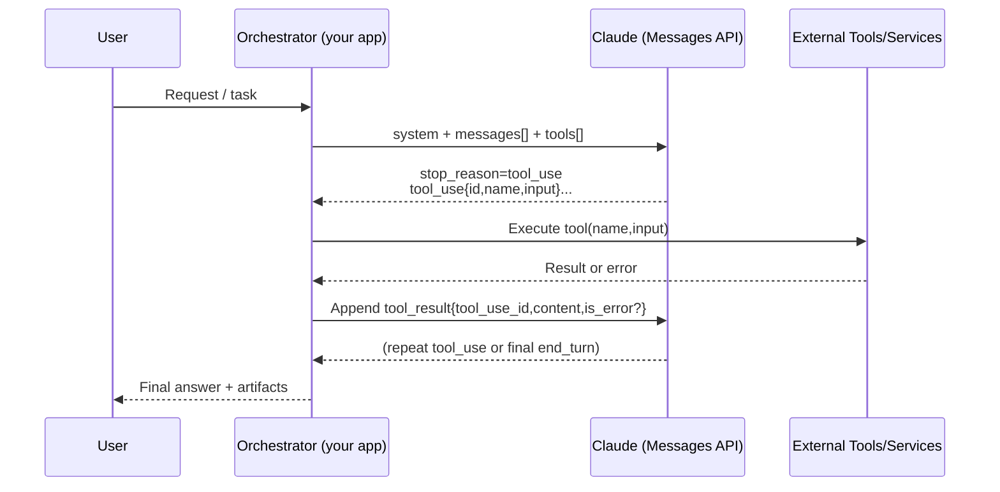
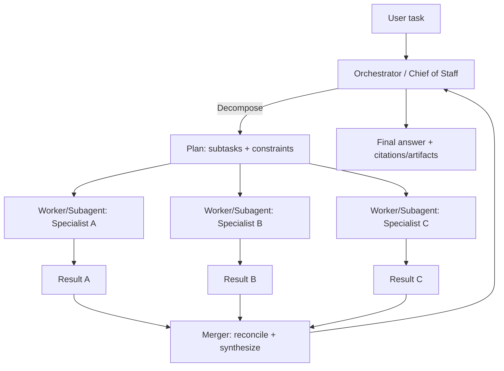
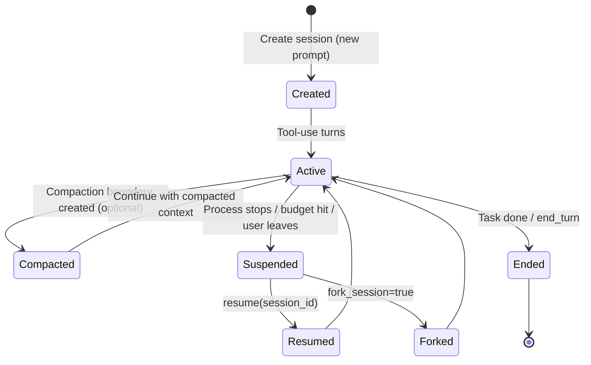
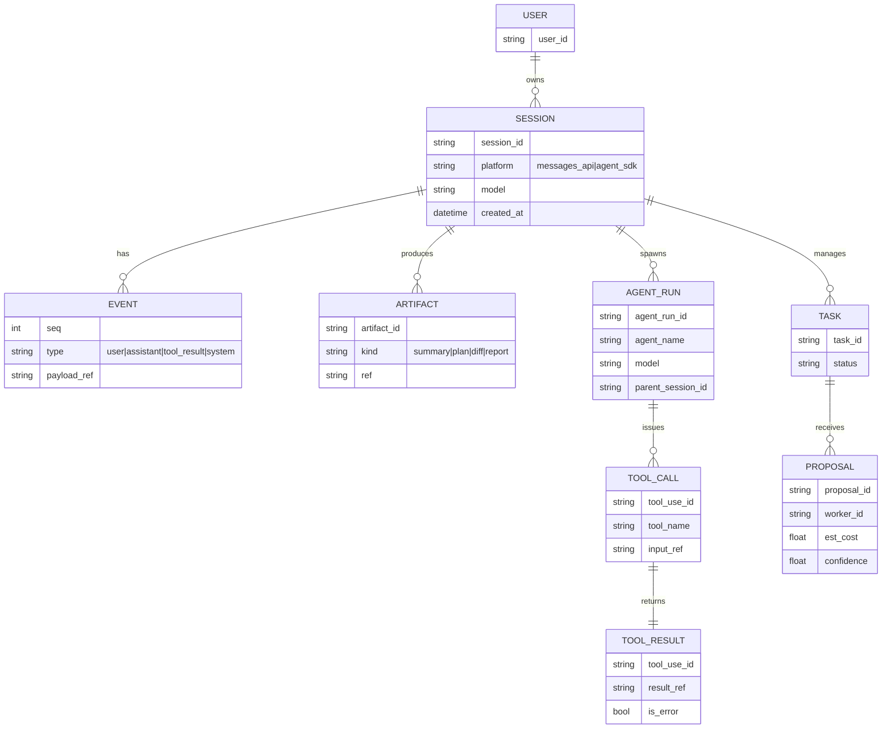

# Domain 1: Agentic Architecture & Orchestration (27%)
## Designing Agentic Loops, Multi-Agent Patterns, and Session Management on Claude

## Executive summary

Claude’s platform supports “agentic” systems in two complementary ways: (1) the **stateless Messages API**, where you build and persist your own loop and session state, and (2) the **Claude Agent SDK**, which packages a production-grade agent loop with built-in tooling, permissions, hooks, subagents, and on-disk sessions (similar to Claude Code’s internals). The deepest design choice is deciding **where the loop and session live**: in your application (Messages API) or inside the SDK (Agent SDK).

For loop correctness and reliability, treat Claude as a **policy/decision engine** that emits structured *actions* (tool calls) and *next-step intent*, while your application enforces **budgets, stop conditions, tool idempotency, and safety constraints**. Claude tool-use responses include a `stop_reason: "tool_use"` and one or more `tool_use` blocks with a unique `id`, a `name`, and an `input` object; your app must execute the tool and send back a `tool_result` that references `tool_use_id`.

For multi-agent systems, Claude’s ecosystem offers both “classic” MAS organizations (master-worker, blackboard, broker, peer-to-peer) and Claude-specific primitives: **subagents** (context-isolated agent instances invoked via the Agent tool), plus cookbook-proven workflows like **orchestrator-workers**, **evaluator-optimizer**, and **routing/parallelization**. Subagents are especially valuable because intermediate tool calls/results stay within the subagent and only its final message returns to the parent, controlling context growth and isolating specialized instructions.

For session management, Claude spans a spectrum from purely application-managed sessions (Messages API is stateless) to SDK-managed sessions that are automatically persisted to disk and support **continue/resume/fork**. The Agent SDK explicitly distinguishes “conversation history” from “filesystem state”: sessions persist the former, while file checkpointing is needed to snapshot/revert file changes.

Operationally, long-lived agent systems must be designed around **context as a finite, degrading resource** (“context rot”), and should use **server-side compaction**, **context editing** (tool-result/thinking clearing), and **prompt caching** to keep cost/latency sustainable. Prompt caching is ZDR-eligible and does not store raw prompt/response text; it uses in-memory KV cache representations and cryptographic hashes with minimum lifetimes (standard 5 minutes, extended 60 minutes), isolated per organization.

## Scope, assumptions, and source strategy

This report focuses **only** on:

Designing **agentic loops**, **multi-agent patterns**, and **session management** for Claude’s platform surfaces (Messages API + Agent SDK), including: state persistence, scaling/fault-tolerance, security/privacy, and testing/observability as they relate to loops/sessions.

Assumptions are intentionally open-ended (language, deployment, scale). Where tradeoffs depend on those choices, options are provided (e.g., in-process vs queue-based orchestration; database vs object storage; strongly consistent vs eventually consistent coordination).

Sources are prioritized as requested:

Anthropic/Claude **official docs and API references** (platform.claude.com), **official cookbooks** (anthropics/claude-cookbooks), and **primary research** on agentic loops and multi-agent systems (e.g., ReAct, Reflexion, Self-Refine, Toolformer, MRKL, AutoGen, contract net and blackboard systems).

## Claude platform primitives for loops, multi-agent systems, and sessions

### Messages API fundamentals that shape loop design

The Messages API is **stateless**: every call must include the needed conversation history (and you may inject synthetic `assistant` messages if your orchestration needs them). This means “session” is an **application-level construct** unless you use the Agent SDK.

Tool use is a first-class loop primitive. When Claude decides it needs a tool, the response includes:

A `stop_reason` of `tool_use`
One or more `tool_use` blocks containing: `id` (unique), `name`, and `input` (object)
Your application executes the tool and continues by sending a `tool_result` content block that references `tool_use_id` (and optionally `is_error: true` for tool failures).

Claude can request **multiple tools per turn**; this can be disabled with `disable_parallel_tool_use=true` when deterministic sequencing or serialized side effects matter.

Tool definitions matter because the API constructs a **tool-use system prompt** from your tool definitions, tool config, and your own system prompt; invalid tool calls are often fixed by better descriptions and schema examples, not by retrying.

Structured outputs and strictness are critical in production agents:

Structured outputs constrain responses to a JSON schema and can also enforce **strict tool use** (`strict: true`) so tool inputs match your schema exactly.

Tool selection controls (`tool_choice`) support modes like `auto`, `any`, `tool`, and `none`, but extended thinking with tools only supports `auto` and `none`.

Known edge case that affects loop reliability: adding text blocks immediately after tool results can train Claude to prematurely end turns; Anthropic documents this as a common cause of empty responses with `stop_reason: "end_turn"`.

### Agent SDK primitives that shape loop and session architecture

The Agent SDK exposes Claude Code’s “autonomous loop” as a library: Claude evaluates the prompt, calls tools, receives tool results, and repeats until completion. A **turn** is one internal round-trip where Claude emits tool calls, the SDK executes them, and results feed back to Claude; the loop ends when Claude produces output with **no tool calls**.

The SDK provides explicit guardrails:

`max_turns` / `maxTurns` caps the number of tool-use round trips (counts tool-use turns only).
`max_budget_usd` / `maxBudgetUsd` caps spend; hitting either yields a `ResultMessage` with error subtypes like `error_max_turns` or `error_max_budget_usd`.

The SDK yields structured message types for observability and control, including SystemMessage lifecycle events, AssistantMessage tool-call turns, UserMessage tool results, StreamEvent (if partials enabled), and a final ResultMessage with output, usage, cost, and session ID.

The SDK’s **context window** accumulates across turns (system prompt, tool definitions, history, tool I/O). It also relies on **prompt caching** for stable prefixes (system prompt/tool definitions/CLAUDE.md), reducing cost/latency for repeated prefixes.

Subagents are a Claude-native multi-agent primitive:

Subagents are separate agent instances spawned by a parent via the Agent tool. They support context isolation and parallelization, and can be configured with role prompts, tool restrictions, and model overrides.
A subagent’s conversation is fresh (no parent history); only the Agent tool’s prompt string bridges parent→subagent, and only the final subagent message returns parentward.
Subagents cannot spawn their own subagents (don’t include `Agent` in a subagent’s tool list).

Sessions are an SDK-level concept:

A session is the conversation history the SDK accumulates (prompt, tool calls/results, responses), written to disk automatically so you can continue later. Sessions persist the conversation, not the filesystem.

Hooks and permissions are core safety controls:

Hooks can block tools, audit tool calls, sanitize inputs/outputs, and track session lifecycle events.
Permissions are evaluated in a documented order (hooks → deny rules → permission mode → allow rules → canUseTool callback). Modes include `dontAsk` (TS), `acceptEdits`, `bypassPermissions`, and `plan`; `bypassPermissions` is explicitly high-risk and is inherited by subagents.

## Designing agentic loops on Claude

### Key definitions

Agentic loop: An iterative control structure that repeatedly (a) forms/updates an internal state estimate, (b) decides next actions, (c) acts through tools or environment interactions, (d) incorporates feedback, and (e) terminates under explicit conditions (goal achieved, budget exhausted, error). This general framing matches “reason+act interleaving” approaches such as ReAct.

Tool-using LLM agent: An LLM that can choose when to call external tools and incorporate results into subsequent reasoning (e.g., Toolformer’s view of models selecting/using APIs; MRKL’s modular composition with discrete modules). Claude implements this behavior through tool definitions, `tool_use` requests, and `tool_result` responses.

Evaluator-optimizer loop: A multi-model (or multi-role) loop where one model generates and another model critiques/evaluates and provides feedback until a stopping criterion is met; this matches Anthropic’s evaluator-optimizer cookbook and academic iterative refinement workflows like Self-Refine.

Reflection loop: An agent produces a reflection based on feedback signals and stores it as memory for future episodes (e.g., Reflexion’s episodic memory buffer). On Claude, similar behavior can be implemented by persisting reflections in session state or using memory artifacts (e.g., memory tool).

### Loop design principles that are Claude-specific

Treat “tool_use.id” as the stable join key between model intent and execution. Claude’s tool-use blocks include a unique `id`; tool results must reference it via `tool_use_id`. This is the natural anchor for (a) deduplicating retries, (b) auditing, and (c) replay-based testing.

Define termination, budgets, and invariants outside the model. The Agent SDK operationalizes this with `max_turns` and `max_budget_usd`; if you build your own loop on the Messages API, replicate those controls at the orchestrator layer.

Constrain model outputs whenever they feed control flow:

Use strict tool use (`strict: true`) to enforce schema conformance for tool parameters.
Use structured outputs if you require parseable “decisions” (e.g., next-state transitions, task routing labels).

Design for context efficiency up front. Long contexts degrade accuracy and recall (“context rot”), so the loop should not indiscriminately append everything; use compaction, context editing (tool-result clearing), and subagents (isolation) strategically.

Avoid known loop anti-patterns that induce premature stopping. Anthropic documents a specific pitfall: adding text blocks immediately after tool results can produce empty end_turn responses. Your loop should send tool results cleanly (without extra chatter) and add new user instructions only when needed.

### Reference architecture: Messages API tool loop



This loop is exactly the “extract tool call → execute → send tool_result” contract in the Claude API primer and tool-use docs.

### Pseudocode: robust “ReAct-style” loop (Messages API)

```pseudo
state Session {
  messages: List<Message>          // canonical transcript for Claude
  tool_dedupe: Map<ToolUseId, ToolResult>  // idempotency store
  budget: {max_steps, max_cost_usd, deadline}
  counters: {steps, cost_usd}
}

function run_agentic_loop(session, tools, system_prompt):
  while true:
    enforce_budget(session)

    response = claude.messages.create(
      system=system_prompt,
      messages=session.messages,
      tools=tools,
      max_tokens=...,
      // optional: structured outputs / tool_choice / disable_parallel_tool_use
    )

    session.counters.cost_usd += response.estimated_cost
    session.messages.append(assistant_message_from(response))

    if response.stop_reason == "tool_use":
      tool_calls = extract_tool_use_blocks(response.content)  // each has id,name,input

      // (Optional) If parallel tool use enabled and safe:
      //   execute in parallel with per-tool concurrency limits.
      for call in tool_calls:
        if session.tool_dedupe.contains(call.id):
          result = session.tool_dedupe[call.id]  // replay instead of re-execute
        else:
          try:
            result = execute_tool(call.name, validate(call.input))
          catch e:
            result = ToolResult(error=true, content=stringify(e))
          session.tool_dedupe[call.id] = result

        // IMPORTANT: send tool_result without adding extra text blocks afterward
        session.messages.append({
          role: "user",
          content: [{type:"tool_result", tool_use_id: call.id, content: result.content, is_error: result.error}]
        })

      continue  // next loop iteration: Claude sees tool_result(s)

    if response.stop_reason == "pause_turn":
      // server tools sometimes return pause_turn; continue by sending paused response back as-is
      // (Your implementation should treat this as a required "continue" step.)
      session.messages.append(paused_response_echo(response))
      continue

    if response.stop_reason == "max_tokens":
      // if tool_use block incomplete, retry with larger max_tokens (per docs)
      // else: ask for continuation via a new user message
      handle_truncation(session, response)
      continue

    // stop_reason == "end_turn" (or other terminal):
    return final_text(response)
```

Key Claude-specific correctness points:

Tool calls include an `id`; tool results must reference it via `tool_use_id`.
Tool errors should be returned with `is_error: true`.
If a response is cut off with `max_tokens` during tool use, retry with higher `max_tokens`.
Avoid adding extra text blocks after tool_result to reduce empty `end_turn` responses.
If you use extended thinking with tool use, only `tool_choice auto/none` works, and you must return thinking blocks for the last assistant message during tool use.

### When to offload the loop to the platform: Tool Runner and Agent SDK

If you want “tool loop orchestration” but not the full Agent SDK environment, Anthropic’s tool-use docs describe an SDK “tool runner” that repeatedly checks for tool requests, executes tools, appends tool results, and continues until Claude returns no tool use.

If you need persistent environments, permissions, sessions, subagents, and deeper observability, the Agent SDK is the canonical approach; it exposes the loop, turn budgeting, message stream types, and automatic prompt caching.

### Performance optimizations that preserve loop semantics

Programmatic tool calling (PTC): lets Claude write code (inside code execution) that calls your tools programmatically, reducing latency and token usage by avoiding repeated model round trips for multi-tool workflows.
Tool search tool: supports hundreds/thousands of tools by searching/loading only what’s needed rather than stuffing all tool schemas into the context.
Prompt caching: place stable content (tools/system/examples) early and cache it; avoid placing cache breakpoints on per-request varying blocks to prevent cache misses.

## Multi-agent patterns and coordination protocols

### Canonical patterns and how they map to Claude

Claude supports multi-agent in two main ways:

Multiple independent Claude calls with different system prompts (classic “multi-LLM workflows”).
Agent SDK subagents, where the parent agent invokes specialized agents with isolated contexts, optional tool restrictions, and optional model overrides, returning only the subagent’s final output.

Anthropic’s cookbooks demonstrate three foundational multi-LLM workflows: prompt-chaining, parallelization, and routing; and an orchestrator-workers workflow where a central LLM decomposes tasks and delegates subtasks to specialized workers.

### Comparison table: multi-agent organizational patterns

The table below assumes Claude is the “cognitive core” and your orchestrator enforces control-flow and persistence.

| Pattern | Complexity | Latency | Throughput | Consistency model | Fault tolerance | Suitability for Claude |
|---|---|---|---|---|---|---|
| Master-worker (Orchestrator-workers) | Medium | Medium (extra orchestration + worker calls) | High (parallel workers) | Strong at orchestrator boundary; weak inside workers unless constrained | Medium–High (retry workers independently) | **Excellent**: directly matches Anthropic pattern; maps cleanly to Agent SDK subagents and tool-use loops. |
| Blackboard (shared workspace/state) | High | Medium | Medium–High | Depends on storage (can be strong) | Medium (shared state is a single failure domain unless replicated) | **Good** for complex reasoning pipelines; aligns with classic blackboard architecture but must manage context growth and synchronization explicitly. |
| Broker / message bus (publish-subscribe, task queue) | Medium–High | Low–Medium (async) | High | Often eventual consistency | High (queue retry, dead-letter queues) | **Very good** at scale; pairs well with stateless Messages API sessions and bursty workloads constrained by rate limits. |
| Peer-to-peer (gossip / swarm) | High | Variable | High (no central bottleneck) | Typically eventual; emergent | High (no single coordinator) | **Situational**: useful for robustness and decentralized discovery, but harder to control costs and ensure determinism; best for exploratory or monitoring swarms. |

Notes on dimensions:

Latency/throughput are dominated by the number of model calls/tool calls and by rate limit token buckets; the platform exposes rate limits (including 429 + retry-after behavior) that your orchestrator must respect.
Consistency depends heavily on whether you maintain a single authoritative session log (event-sourcing) and whether agents write to shared state directly or only through the orchestrator.

### Reference architecture: orchestrator-workers + subagents



This is the shape of Anthropic’s orchestrator-workers cookbook, and is directly supported by Agent SDK subagents designed for context isolation and specialized prompts.

### Coordination protocols: from MAS research to Claude implementations

Contract Net Protocol (CNP) is a classic task allocation protocol (manager announces task, contractors bid, manager awards, contractor reports completion). The original protocol is described by Smith (1980) and formalized in standards like the FIPA Contract Net Interaction Protocol.

A Claude-friendly “CNP-style” coordination contract is useful when:

You have many candidate workers (different prompts/models/tools) and want dynamic selection based on bids (estimated cost/time/confidence).
You want the orchestrator to remain thin while workers self-estimate feasibility.

#### Message schema for a Claude-based CNP

```json
{
  "type": "call_for_proposal",
  "task_id": "uuid",
  "objective": "...",
  "constraints": {"deadline": "...", "budget_usd": 1.00},
  "required_artifacts": ["patch", "test_report"],
  "evaluation_rubric": {"score_0_5": "..."}
}
```

```json
{
  "type": "proposal",
  "task_id": "uuid",
  "worker_id": "agent:sonnet-security-reviewer",
  "estimated_cost_usd": 0.12,
  "estimated_turns": 4,
  "confidence": 0.73,
  "plan": ["step1", "step2"]
}
```

```json
{
  "type": "award",
  "task_id": "uuid",
  "worker_id": "agent:sonnet-security-reviewer"
}
```

#### Pseudocode: CNP allocation loop (Claude orchestrated)

```pseudo
function allocate_task_CNP(task):
  proposals = parallel_map(workers, w => w.propose(task))   // Claude calls w with fixed schema output
  winner = argmax(proposals, score = utility(confidence, cost, turns))
  send_award(winner)
  result = winner.execute(task)
  return result
```

This leverages the same “generator + evaluator” separation Anthropic recommends in evaluator-optimizer workflows, and aligns with multi-agent conversation systems like AutoGen (multi-agent programming via conversation patterns).

Blackboard architecture: A shared “blackboard” holds partial solutions and hypotheses; multiple specialized knowledge sources opportunistically contribute. The blackboard model and its evolution are classically described by Nii (1986).

A Claude-style blackboard typically means:

A shared persistent store (DB / object store) holds the task graph, intermediate artifacts, and decisions.
Agents read/write the blackboard through tools; the orchestrator enforces schemas and access control to prevent prompt injection and data corruption.

## Session management and lifecycle

### Two session models on Claude

Application-managed sessions (Messages API). Since the Messages API is stateless, your service must store and replay the entire conversation history (or a curated subset) for each turn.

SDK-managed sessions (Agent SDK). The SDK defines a session as the accumulated conversation history including tool calls/results and writes it to disk so you can continue later. It supports continuing the most recent session, resuming by ID, and forking to branch conversation history.

### Agent SDK session operations: continue, resume, fork

Continue: finds the most recent session in the current directory (TypeScript: `continue: true`; Python: `continue_conversation=True`).
Resume: resumes a specific session by ID, enabling multi-user apps where each user maps to a session ID.
Fork: creates a new session with a copy of history but diverges from that point; branching history is not branching filesystem changes.
Stateless option: TypeScript can set `persistSession: false` so the session exists only in memory; Python always persists to disk.

Sessions are stored under `~/.claude/projects/<encoded-cwd>/*.jsonl`, and resuming can fail if `cwd` differs across runs. Resuming across hosts requires copying the session file to the same path (and matching `cwd`), or avoiding resume and instead passing key state into a new session prompt.

### Session lifecycle diagram



Compaction and context management are explicit concerns in long-lived sessions:

Server-side compaction (Messages API) detects token thresholds, summarizes, creates a `compaction` block, and drops blocks prior to it on subsequent requests; you must pass the compaction block back each turn.
Context editing provides fine-grained clearing strategies (tool-result clearing, thinking-block clearing) and is enabled via a beta header; Anthropic positions server-side compaction as the primary strategy for most long-running conversations.
Prompt caching reduces repeated-prefix cost/latency and has concrete constraints (e.g., lookback window of 20 blocks per breakpoint) that affect how you structure session prompts.

### Session-state design goals and tradeoffs

Strong session continuity vs portability:

Agent SDK sessions are locally persisted transcripts; portability across hosts requires moving files or extracting state into your own store.
Messages API sessions are naturally portable because your datastore is authoritative, but you must implement compaction/caching/memory yourself.

High-fidelity transcript vs curated state:

Raw transcripts maximize recoverability but inflate context and cost.
Curated “working memory” (summaries, task state, retrieved facts) improves focus and cost but risks losing subtle constraints unless explicitly persisted.

Claude’s official docs emphasize that context volume alone is not beneficial; as tokens grow, accuracy and recall degrade (“context rot”), making curation essential.

## Persistence, scaling and fault tolerance, security/privacy, testing/observability

### State persistence strategies

Event-sourcing for sessions (recommended default). Store every user message, assistant message (including tool_use), tool_result, and orchestrator decision as an append-only event log. This mirrors how the Agent SDK conceptualizes sessions as complete histories that can be resumed/forked.

Snapshot + delta. Periodically produce a snapshot (“session summary” + structured task state) so you can:

Rehydrate quickly.
Bound prompt size (especially if you don’t use server-side compaction).
Support fork/branch operations by copying snapshots + replaying deltas.

Claude-native memory artifacts:

Memory tool: Claude can create/read/update/delete memory files in `/memories` as a client-side tool; you control storage and retention. The doc provides a multi-session pattern where an initializer session bootstraps progress logs/checklists and subsequent sessions read/update them.
CLAUDE.md and project-level artifacts: Agent SDK workflows often use CLAUDE.md as persistent instructions and “memory” across sessions.

### Scaling and fault tolerance considerations

Rate limits and backpressure. Claude enforces rate limits organized into tiers; exceeding fast mode limits yields 429 with a `retry-after` header (and fast-mode-specific headers). Your orchestrator should implement client-side rate limiting and adaptive concurrency.

Long-running requests and network faults:

Every API response includes a `request-id` header and request_id field for debugging.
For long requests (especially >10 minutes), Anthropic recommends streaming or Message Batches to reduce risk of network drops and to poll results rather than requiring uninterrupted connections.

Stop-reason-aware control flow (Messages API):

`tool_use`: execute tools and send tool_result blocks.
`pause_turn`: may occur with server tools; continue by passing the paused response back as-is.
`max_tokens`: if tool_use is incomplete, retry with larger `max_tokens`.
`end_turn` empty response edge case: avoid adding text blocks immediately after tool_result; if needed, add a new user “continue” message rather than replaying the empty response.

Tool execution idempotency. Because tool calls can have side effects (DB writes, ticket creation), deduplicate by `tool_use.id` and record the executed result (or error) so retries can safely replay without re-executing. The Claude tool-use contract provides the stable identifier you need.

### Security and privacy implications

Data retention and ZDR. Anthropic documents ZDR scope and exceptions:

For ZDR-enabled endpoints, customer data is not stored at rest after the response except where needed for law/misuse; retained data is not used for model training without express permission.
CORS is not supported for ZDR organizations; browser apps must use a backend proxy and must never expose API keys in browser JavaScript.

Prompt caching privacy. Prompt caching is ZDR-eligible; Anthropic does not store raw prompt/response text. KV cache representations and cryptographic hashes are held in memory only, with minimum lifetimes (5 minutes standard, 60 minutes extended) and are isolated between organizations.

Least privilege for tools and subagents:

Agent SDK permissions include allow/deny rules, modes like `dontAsk`, and the ability for hooks to block/modify tool calls. Deny rules are evaluated early and apply even in `bypassPermissions`.
`bypassPermissions` grants full autonomous tool access and is inherited by subagents; subagents may have different system prompts and less constrained behavior, so this mode is explicitly risky.

Mitigating prompt injection and tool misuse (loop-specific). Although the broader prompt-injection guidance is outside this report’s scope, loop designers should:

Validate and sanitize tool inputs from model outputs (even with strict tools, validate at boundaries).
Restrict tool surfaces and require human approval for high-risk operations (Agent SDK supports plan mode and approval callbacks; hooks can require approval).

### Testing and observability approaches

Structured logging and audit trails. Agent SDK hooks are designed for exactly this: log every tool call, block dangerous operations, add compliance/audit layers, and track session lifecycle events.

SDK-level debug logging for tool failures. Anthropic notes that enabling `ANTHROPIC_LOG=info` or `debug` surfaces full exception details and stack traces when a tool fails (implementation varies by language SDK).

Evaluation-driven development for loops and agents. Anthropic’s testing guidance emphasizes defining measurable success criteria, building rubrics, and using empirical grading where possible for scalable assessment.

Multi-agent evaluation. Anthropic’s tool evaluation cookbook explicitly uses multiple agents to run evaluation tasks independently, which is useful for variance reduction and consensus scoring in agentic workflows.

Operational observability of cost and caching. Anthropic provides a Usage & Cost API and cookbooks for monitoring token consumption (including cache reads/writes) and spending—critical for keeping loops within budgets.

## Implementation artifacts: sample schemas, best-practice checklists, and prioritized sources

### Sample session schemas

#### Messages API session schema (application-managed)

```json
{
  "session_id": "uuid",
  "user_id": "uuid-or-external-id",
  "created_at": "RFC3339",
  "updated_at": "RFC3339",
  "model": "claude-opus-4-6",
  "system_prompt_version": "v12",
  "messages": [
    {
      "seq": 1,
      "role": "user",
      "content": "..."
    },
    {
      "seq": 2,
      "role": "assistant",
      "content_blocks": [
        {"type": "text", "text": "..."},
        {"type": "tool_use", "id": "toolu_x", "name": "search_db", "input": {"q": "..."}}
      ],
      "stop_reason": "tool_use"
    },
    {
      "seq": 3,
      "role": "user",
      "content_blocks": [
        {"type": "tool_result", "tool_use_id": "toolu_x", "content": "...", "is_error": false}
      ]
    }
  ],
  "tool_results_index": {
    "toolu_x": {"content_hash": "sha256:...", "stored_at": "RFC3339"}
  },
  "policy": {
    "max_steps": 20,
    "max_cost_usd": 1.50,
    "deadline_ms": 20000,
    "disable_parallel_tool_use": true
  },
  "context_management": {
    "strategy": "server_compaction|client_compaction|none",
    "last_compaction_seq": 120,
    "cache_control": {"type": "ephemeral"},
    "context_editing": {"enabled": false}
  },
  "artifacts": [
    {"type": "summary", "ref": "obj://.../summary-v3.json"},
    {"type": "plan", "ref": "obj://.../plan.json"},
    {"type": "blackboard_state", "ref": "db://.../task_state"}
  ]
}
```

This schema matches Claude’s documented stateless Messages pattern and tool-use block structure (`tool_use` with `id`, `tool_result` referencing `tool_use_id`).

#### Agent SDK session schema (hybrid: SDK session + your metadata)

```json
{
  "sdk_session_id": "sdk-generated",
  "cwd": "/abs/path/project",
  "session_file_hint": "~/.claude/projects/<encoded-cwd>/<session-id>.jsonl",
  "created_at": "RFC3339",
  "last_seen_at": "RFC3339",
  "mode": "continue|resume|fork",
  "parent_session_id": "optional",
  "limits": {"max_turns": 30, "max_budget_usd": 2.00},
  "permissions": {"mode": "default", "allowed_tools": ["Read","Edit"], "disallowed_tools": ["Bash"]},
  "subagents": [
    {"name": "code-reviewer", "model": "sonnet", "tools": ["Read","Grep","Glob"]}
  ],
  "exports": {
    "final_result": "obj://.../result.txt",
    "audit_log": "obj://.../audit.jsonl"
  }
}
```

Why store this yourself: SDK sessions are local to the machine and tied to `cwd`; if you need cross-host resumption or multi-user routing, you’ll want a database record that maps users/tasks to `(session_id, cwd, host)` and a safe export path.

### Entity relationship diagram for multi-agent + sessions



This ER model supports blackboard and broker architectures (shared TASK/ARTIFACT store), and it cleanly models contract-net style proposals for dynamic worker allocation.

### Best-practice checklists

#### Agentic loop checklist (Messages API or SDK)

Define stop conditions: goal achieved, max tool turns, max cost, deadline. (Agent SDK provides `max_turns` and `max_budget_usd`—replicate these in custom loops.)  
Use schema enforcement: strict tools (`strict: true`) and/or structured outputs for any control-plane outputs.  
Treat tool execution as untrusted: validate tool inputs, sanitize outputs, and dedupe by `tool_use.id`.  
Avoid “tool_result + extra text” in the same user message unless explicitly needed; it can cause empty end_turn responses.  
Keep context lean: use compaction/context editing/subagents to control context rot and costs.

#### Multi-agent checklist

Choose an organization pattern intentionally (master-worker vs blackboard vs broker vs P2P) based on latency/throughput/consistency requirements and operational constraints (rate limits).  
Use context isolation for specialists (Agent SDK subagents) to prevent “prompt bloat” and to avoid contaminating the main agent’s long-term context.  
Standardize agent-to-agent message schemas (especially for proposals, critiques, and handoffs). Inspired by contract net protocols and evaluator-optimizer loops.  
Bound concurrency: parallel workers can saturate RPM/TPM; implement worker pools and backpressure.

#### Session management checklist

Messages API: persist full history or curated summaries; remember statelessness means *you* must replay context each turn.  
Use server-side compaction when long-lived sessions are required; pass compaction blocks back every turn afterward.  
Use prompt caching to reduce repeated-prefix cost/latency; place cache breakpoints on static prefixes (avoid timestamps and per-request suffixes).  
Agent SDK: understand continue/resume/fork semantics and the cwd-tied local session storage; plan for cross-host continuity explicitly.

#### Security/privacy checklist (loop/session specific)

Do not expose API keys in browsers; ZDR orgs must use a backend proxy (CORS not supported).  
Use least-privilege tool access: allow/deny rules, safe permission modes, and hooks for risky tools; treat `bypassPermissions` as high risk (especially with subagents).  
Understand retention: prompt caching stores no raw text; ZDR covers Messages API but can have exceptions for law/misuse.

#### Testing/observability checklist

Instrument every tool call and tool result (hook-based if using Agent SDK); include `tool_use_id`, latency, and success/failure.  
Turn on SDK debug logs when diagnosing tool failures (`ANTHROPIC_LOG=info|debug`).  
Build evals with measurable rubrics; use code-based graders where possible and LLM-based graders with explicit scoring instructions where necessary.  
Track cost/caching efficiency using usage/cost APIs and cache-related metrics.

### Prioritized source links (official first)

```text
Official Claude platform docs (core)
https://platform.claude.com/docs/en/build-with-claude/working-with-messages
https://platform.claude.com/docs/en/claude_api_primer
https://platform.claude.com/docs/en/agents-and-tools/tool-use/overview
https://platform.claude.com/docs/en/agents-and-tools/tool-use/define-tools
https://platform.claude.com/docs/en/build-with-claude/compaction
https://platform.claude.com/docs/en/build-with-claude/context-editing
https://platform.claude.com/docs/en/build-with-claude/prompt-caching
https://platform.claude.com/docs/en/build-with-claude/api-and-data-retention
https://platform.claude.com/docs/en/api/rate-limits
https://platform.claude.com/docs/en/api/errors

Official Agent SDK docs (loop + sessions + multi-agent)
https://platform.claude.com/docs/en/agent-sdk/agent-loop
https://platform.claude.com/docs/en/agent-sdk/sessions
https://platform.claude.com/docs/en/agent-sdk/subagents
https://platform.claude.com/docs/en/agent-sdk/hooks
https://platform.claude.com/docs/en/agent-sdk/permissions
https://platform.claude.com/docs/en/agent-sdk/hosting

Official Claude cookbooks (patterns)
https://platform.claude.com/cookbook/patterns-agents-basic-workflows
https://platform.claude.com/cookbook/patterns-agents-orchestrator-workers
https://platform.claude.com/cookbook/patterns-agents-evaluator-optimizer

Official cookbook repository
https://github.com/anthropics/claude-cookbooks

Primary academic sources (agentic loops + multi-agent systems)
https://arxiv.org/abs/2210.03629  (ReAct)
https://arxiv.org/abs/2303.11366  (Reflexion)
https://arxiv.org/abs/2303.17651  (Self-Refine)
https://arxiv.org/abs/2302.04761  (Toolformer)
https://arxiv.org/abs/2205.00445  (MRKL Systems)
https://arxiv.org/abs/2308.08155  (AutoGen)
https://reidgsmith.com/The_Contract_Net_Protocol_Dec-1980.pdf  (Contract Net)
https://ojs.aaai.org/aimagazine/index.php/aimagazine/article/view/537  (Blackboard model – Nii 1986)
https://www.dca.fee.unicamp.br/projects/sapiens/Resources/Agents/Platforms/FIPA/specs/fipa00029/XC00029E.html  (FIPA Contract Net)
```

