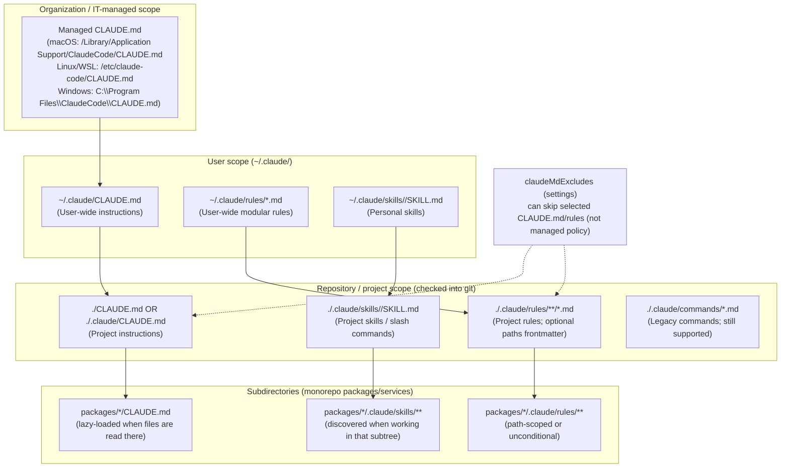

# Domain 2: Claude Code Configuration & Workflows (20%)
## CLAUDE.md, Custom Slash Commands, and CI/CD Integration for Claude Code

## Executive Summary

Claude Code’s configuration and automation ecosystem can be understood as four interacting layers: **memory** (CLAUDE.md + rules), **skills** (custom slash commands), **enforcement** (settings/permissions/sandboxing/hooks), and **delivery** (CI/CD + managed deployments). CLAUDE.md is the core “project memory” mechanism: a Markdown file (or set of files) that Claude Code automatically loads to provide persistent project context and working conventions, reducing repeated onboarding per session. There is **no required format**, but Anthropic recommends **concise, structured, concrete** instructions, typically targeting **under ~200 lines per CLAUDE.md** for better adherence. citeturn1view0turn4view0

Claude Code supports a **hierarchical loading model** for CLAUDE.md and rules: organization-wide **managed policy** (OS-level path), user-wide (`~/.claude/CLAUDE.md`), project-wide (`./CLAUDE.md` or `./.claude/CLAUDE.md`), plus additional CLAUDE.md files in ancestor directories; CLAUDE.md files in **subdirectories are lazy-loaded** when Claude reads files in those directories. For scale, Anthropic recommends modularizing with `.claude/rules/` (optionally path-scoped via YAML frontmatter) and with `@path/to/import` imports (recursive up to five hops). citeturn4view0

“Custom slash commands” are now best modeled as **Skills**: a standard, YAML-frontmatter + Markdown instruction package discovered from `.claude/skills/<name>/SKILL.md` (and optionally supporting files/scripts). Skills can be invoked manually via `/skill-name`, can be made model-invocable or user-only, can restrict tools during execution, and can inject dynamic context using a safe-but-powerful preprocessor syntax `!`<command>`` that runs shell commands before Claude sees the prompt (a major security consideration). Legacy `.claude/commands/*.md` commands still work and are supported in both CLI and Agent SDK contexts; if a skill and a legacy command share a name, the **skill takes precedence**. citeturn5view0turn13view0

For CI/CD, there are two distinct patterns: **(A) validate and ship configuration changes** (CLAUDE.md/rules/skills/settings) like any other critical “policy-as-code,” and **(B) run Claude Code inside CI** to automate reviews, changes, and operational tasks. Official integrations exist for **GitHub Actions** (via `anthropics/claude-code-action@v1` and the Claude GitHub App) and **GitLab CI/CD** (beta, maintained by GitLab). Security hinges on least-privilege permissions, secrets isolation (e.g., masked variables/OIDC), sandboxing, and the ability to audit/observe behavior via debug logs, hooks, and OpenTelemetry telemetry export. citeturn10view2turn10view3turn6view0turn10view0turn21view0

## CLAUDE.md Purpose, Syntax, and Hierarchy Conventions

Claude Code sessions start with a fresh context window, so persistent project guidance is supplied through **memory files**. Anthropic describes two complementary memory mechanisms: **CLAUDE.md files** (written by you) and **auto memory** (notes written by Claude, if enabled). CLAUDE.md is the primary place for “what must be true” about your project: architecture map, commands, coding standards, workflows, and constraints. citeturn4view0turn1view0

### What CLAUDE.md is (and is not)

CLAUDE.md is a **Markdown** “project memory” file that Claude Code reads at the start of sessions to provide persistent context and instructions; it is treated as contextual guidance (not a hard enforcement mechanism), so clarity and specificity strongly affect compliance. citeturn4view0turn1view0

Anthropic explicitly notes there is **no required format**. Best results come from concise sections that are easy for both humans and Claude to scan (headers, bullets, concrete rules). citeturn1view0turn4view0

### Canonical locations and precedence

Claude Code supports multiple CLAUDE.md locations (different scopes). In official docs, the key ones are:

- **Managed policy (organization-wide)**:  
  macOS: `/Library/Application Support/ClaudeCode/CLAUDE.md`  
  Linux/WSL: `/etc/claude-code/CLAUDE.md`  
  Windows: `C:\Program Files\ClaudeCode\CLAUDE.md` citeturn4view0turn6view1  
  This file is intended for company-wide standards and cannot be excluded by user settings. citeturn4view0

- **Project instructions (team/shared)**: `./CLAUDE.md` or `./.claude/CLAUDE.md` citeturn4view0turn6view1  
  This is the common “repo-owned” policy surfaced to every collaborator via version control. citeturn4view0

- **User instructions (personal)**: `~/.claude/CLAUDE.md` citeturn4view0turn6view1  
  Intended for preferences that apply across all projects. citeturn4view0

Anthropic summarizes the precedence principle as: **more specific locations take precedence over broader ones**, but everything is still “context,” not a strict enforcement layer. citeturn4view0

### Load and resolution behavior

Claude Code loads CLAUDE.md by **walking up the directory tree** from the current working directory. Example: run in `foo/bar/` and it loads from `foo/bar/CLAUDE.md` and `foo/CLAUDE.md`. citeturn4view0

It also “discovers” CLAUDE.md in subdirectories—but these are **not loaded at launch**. Instead, they are **lazy-loaded on demand** when Claude reads files in those subdirectories. This is crucial for monorepos: package/service-specific CLAUDE.md content only appears when you work within that area. citeturn4view0

To prevent irrelevant instructions in very large repos, Claude Code provides `claudeMdExcludes` (glob patterns matched against absolute paths) to skip selected CLAUDE.md or rules paths; arrays merge across settings layers, but **managed policy CLAUDE.md cannot be excluded**. citeturn4view0turn6view1

### Syntax features and “metadata-like” mechanisms

Although CLAUDE.md itself has no formal schema, there are several special behaviors that function like metadata/structure controls:

**Imports with `@path/to/import`**  
CLAUDE.md can import additional files using `@path/to/import`. Imported files are expanded and loaded into context at launch alongside the referencing CLAUDE.md. Relative paths resolve relative to the importing file (not the working directory). Imports can cascade up to **five recursive hops**. citeturn4view0

External/personal imports are possible (e.g., `@~/.claude/my-project-instructions.md`). Claude Code will show an approval dialog the first time it encounters external imports; declining disables them without re-prompting. citeturn4view0

**HTML comment stripping for token efficiency**  
Block-level HTML comments (`<!-- ... -->`) inside CLAUDE.md are stripped before injection into the context window (helpful for leaving maintainer notes without spending tokens). citeturn4view0

**Compatibility with other agents via AGENTS.md**  
Claude Code reads `CLAUDE.md`, not `AGENTS.md`. If your repo already uses `AGENTS.md`, Anthropic recommends creating `CLAUDE.md` that imports `@AGENTS.md` to share instructions across tools without duplication. citeturn4view0

### Scaling beyond a single file: `.claude/rules/`

For larger projects, Anthropic recommends modular instruction files under `.claude/rules/`. Rules can be discovered recursively and kept topic-focused (`testing.md`, `security.md`, etc.). citeturn4view0

Rules support YAML frontmatter with `paths` to scope rules to particular files/directories using glob patterns (including brace expansion). Rules without `paths` load unconditionally at launch (with the same priority as `.claude/CLAUDE.md`). citeturn4view0

### Versioning implications and “unknown version/platform” note

You did not specify a Claude Code version or platform (CLI vs IDE vs web). Official documentation shows version-gated behaviors. Examples:

- Auto memory requires Claude Code **v2.1.59+**. citeturn4view0  
- A Windows managed-settings path was deprecated “as of v2.1.75,” forcing managed deployment migrations. citeturn6view1  
- `/init` has an enhanced interactive flow controlled by `CLAUDE_CODE_NEW_INIT=true`. citeturn4view0turn9view0  

Because these behaviors vary by version, teams should treat CLAUDE.md/rules/skills/settings as **versioned operational assets**: make changes via PRs, record the minimum Claude Code version required, and include CI checks to avoid using unsupported features in older clients. citeturn6view1turn4view0

### CLAUDE.md hierarchy diagram (Mermaid)



This diagram reflects the documented locations and behaviors: managed/user/project scopes, `.claude/rules/` path scoping, skills replacing custom commands, and lazy loading of subdirectory CLAUDE.md. citeturn4view0turn5view0turn6view1

## Custom Slash Commands: Definition, Registration, Implementation, and Security

Claude Code supports two “slash command” categories:

- **Built-in commands** (fixed logic; e.g., `/config`, `/memory`, `/add-dir`, `/init`). citeturn9view0  
- **Skills (prompt-based)**, including bundled skills (e.g., `/batch`, `/simplify`) and your own custom skills (your “custom slash commands”). citeturn5view0turn9view0  

### Where custom commands live and how they’re discovered

Anthropic’s current recommendation is to implement custom slash commands as **skills**:

- **Project skills**: `.claude/skills/<skill-name>/SKILL.md`  
- **Personal skills**: `~/.claude/skills/<skill-name>/SKILL.md` citeturn5view0  

Discovery is filesystem-based; you “register” a skill by placing the directory and `SKILL.md` in one of the recognized locations. Claude Code also discovers skills in nested `.claude/skills/` folders in monorepos (e.g., `packages/frontend/.claude/skills/` when editing within `packages/frontend/`). citeturn5view0

Legacy commands still work:

- `.claude/commands/` is the legacy format, but is still supported in CLI and SDK contexts. The Agent SDK docs also emphasize that `.claude/skills/<name>/SKILL.md` is now the recommended format and that the CLI supports both. citeturn13view0turn5view0

If a skill and a legacy command share the same name, **the skill takes precedence**. citeturn5view0

### Skill file format and metadata fields

A skill’s `SKILL.md` has:

- Optional **YAML frontmatter** between `---` markers
- Markdown instructions (the “prompt playbook”) citeturn5view0

Key frontmatter fields include `name`, `description`, `argument-hint`, `disable-model-invocation`, `user-invocable`, `allowed-tools`, `model`, `effort`, `context` (e.g., `fork`), `agent`, `hooks`, `paths` (path-scoped activation), and `shell`. citeturn5view0

#### Arguments and parameter “types”

Skills support structured argument substitution:

- `$ARGUMENTS` (all arguments)
- `$ARGUMENTS[N]` or shorthand `$N` for positional args
- `${CLAUDE_SESSION_ID}` and `${CLAUDE_SKILL_DIR}` for session correlation and robust file/script referencing citeturn8view0turn5view0

In the Agent SDK documentation, custom commands (legacy but still supported) also use `$1`, `$2`-style positional placeholders and `argument-hint` for autocomplete guidance. citeturn13view0

### Permissioning and tool access

Claude Code provides a tiered permissions model: read-only tools (no approval), bash execution (approval with “don’t ask again” persistence), and file modification (approval until session end). citeturn6view0

For skills specifically:

- `allowed-tools` can grant tool access without extra prompts **while the skill is active**; baseline permissions still apply outside the skill. citeturn5view0turn6view0  
- You can restrict which skills Claude can invoke by denying the `Skill` tool (or allowing only selected skills) in permission rules. citeturn5view0turn6view0  
- The CLI can disable skills/commands entirely for a session with `--disable-slash-commands`. citeturn19view0  

### Debugging and testing custom commands

Relevant first-party debugging options include:

- `claude --debug` (with optional category filtering) and `--verbose` for more detailed logs. citeturn19view0  
- Bundled `/debug` skill and other built-ins (discoverable via typing `/`). citeturn5view0turn9view0  
- In CI contexts, the GitLab integration example runs `claude ... --debug` explicitly. citeturn11view1  

For testing strategy, the docs strongly support a “policy-as-code” approach: keep SKILL.md focused and move heavy logic into scripts in the skill directory (testable with normal unit/integration testing). Anthropic explicitly shows skills bundling scripts (example uses Python) and recommends keeping `SKILL.md` under ~500 lines by moving reference material out. citeturn5view0

### Security considerations: injection, auth, and secrets

Custom slash commands/skills are extremely powerful, so security must be designed in—not bolted on.

**Prompt/tool injection via command preprocessing**  
Skills can run shell commands *before* Claude sees the prompt using the preprocessor `!`<command>``; the output is substituted into the prompt. This is convenient for injecting “live context” (diffs, PR metadata, status), but also increases the blast radius of argument mishandling. citeturn5view0

The official repository’s legacy command example uses `allowed-tools` plus `!`-injected outputs (git status/diff/branch) to drive a commit/push/PR workflow—illustrating both power and risk. citeturn18view0

**Defense-in-depth: permissions + sandboxing**  
Anthropic positions sandboxing as a complement to permissions: permissions gate what tools can be used; sandboxing provides OS-level boundaries for Bash subprocess filesystem/network access. Sandboxing uses Seatbelt (macOS) or bubblewrap (Linux/WSL2), enforces domain restrictions via a proxy, and can be configured to reduce approval fatigue while maintaining guardrails. citeturn10view0turn6view0

**Secrets management and environment scrubbing**  
In CI/CD and automation contexts, avoid passing cloud credentials into subprocess environments. Claude Code provides `CLAUDE_CODE_SUBPROCESS_ENV_SCRUB=1` to strip Anthropic/cloud provider credentials from subprocess environments (Bash tool, hooks, MCP stdio servers), explicitly describing this as reducing exposure to prompt injection attempts that exfiltrate secrets via shell expansion. citeturn21view1

**Authentication patterns for enterprise CI**  
GitLab’s integration best practices explicitly recommend: never commit API keys; use masked variables and provider-specific OIDC where possible (no long-lived keys). The official docs also provide OIDC-based examples for AWS Bedrock and workload identity federation for Google Vertex AI. citeturn11view4turn11view0

### A concrete custom slash command implementation template

Below is a **skill-based** custom slash command that validates CLAUDE.md/rules/skills for common errors and security problems. It demonstrates: frontmatter controls, argument hints, safe tool restrictions, and a supporting script (Python).

#### File tree

```text
.claude/
  skills/
    validate-claude/
      SKILL.md
      scripts/
        validate_claude.py
```

#### `SKILL.md`

```md
---
name: validate-claude
description: Validate CLAUDE.md, .claude/rules, and skills for broken @imports, oversized files, and unsafe patterns. Use before merging config changes.
argument-hint: [path]
disable-model-invocation: true
allowed-tools: Bash(python *), Read, Grep, Glob
---

# Validate Claude Code configuration

Run the validator script and then explain any failures, plus propose fixes.

## Run (deterministic)
- Execute:
  `python ${CLAUDE_SKILL_DIR}/scripts/validate_claude.py ${ARGUMENTS:-.}`

## Output requirements
- Print a concise summary: PASS/FAIL plus counts.
- If FAIL, list problems grouped by file and type (missing import, invalid frontmatter, secret-like token, size limit).
- For each problem: provide an exact patch suggestion.
```

This uses `${CLAUDE_SKILL_DIR}` (a first-party substitution) to reliably locate the bundled script across working directories. citeturn8view0turn5view0

#### `scripts/validate_claude.py` (Python example)

```python
#!/usr/bin/env python3
"""
Minimal config validator for Claude Code memory/skills files.

Checks:
- CLAUDE.md and *.md under .claude/rules/ for file size guidance (warn > 200 lines).
- Skills: existence of SKILL.md and YAML frontmatter markers.
- @imports references exist (best-effort scan).
- Simple secret-like patterns in committed files (best-effort).
"""
from __future__ import annotations

import os
import re
import sys
from pathlib import Path

IMPORT_RE = re.compile(r'@([~/.\w\-\+/]+)')  # conservative
SECRET_RE = re.compile(r'(AKIA[0-9A-Z]{16}|-----BEGIN (RSA|OPENSSH) PRIVATE KEY-----)', re.IGNORECASE)

def read_text(path: Path) -> str:
    try:
        return path.read_text(encoding="utf-8", errors="replace")
    except Exception as e:
        return f"__READ_ERROR__: {e}"

def find_imports(text: str) -> list[str]:
    return [m.group(1) for m in IMPORT_RE.finditer(text)]

def resolve_import(base: Path, ref: str) -> Path:
    if ref.startswith("~/"):
        return Path.home() / ref[2:]
    if ref.startswith("/"):
        return Path(ref)
    return (base / ref).resolve()

def main(root: str) -> int:
    repo = Path(root).resolve()
    problems: list[str] = []

    candidates = []
    for rel in ["CLAUDE.md", ".claude/CLAUDE.md"]:
        p = repo / rel
        if p.exists():
            candidates.append(p)

    rules_dir = repo / ".claude" / "rules"
    if rules_dir.exists():
        candidates.extend([p for p in rules_dir.rglob("*.md") if p.is_file()])

    skills_dir = repo / ".claude" / "skills"
    if skills_dir.exists():
        for d in skills_dir.iterdir():
            if d.is_dir():
                skill_md = d / "SKILL.md"
                if not skill_md.exists():
                    problems.append(f"[SKILL] Missing SKILL.md in {d}")
                else:
                    content = read_text(skill_md)
                    if not content.lstrip().startswith("---"):
                        problems.append(f"[SKILL] SKILL.md missing YAML frontmatter start (---): {skill_md}")

    for p in candidates:
        content = read_text(p)
        lines = content.splitlines()
        if len(lines) > 200:
            problems.append(f"[SIZE] {p.relative_to(repo)} has {len(lines)} lines (recommend ~<=200 for CLAUDE.md-like files).")
        if SECRET_RE.search(content):
            problems.append(f"[SECRET] Possible secret material detected in {p.relative_to(repo)}")

        for imp in find_imports(content):
            resolved = resolve_import(p.parent, imp)
            # Note: external imports may be intentionally missing on CI machines; treat as warning.
            if not resolved.exists():
                problems.append(f"[IMPORT] {p.relative_to(repo)} references missing import: @{imp} -> {resolved}")

    if problems:
        print("FAIL")
        for pr in problems:
            print(" -", pr)
        return 1

    print("PASS")
    return 0

if __name__ == "__main__":
    sys.exit(main(sys.argv[1] if len(sys.argv) > 1 else "."))
```

This is intentionally conservative: it treats “home directory imports” as potentially missing on CI and surfaces them as findings rather than silently ignoring. That aligns with Anthropic’s support for home-directory imports (but also highlights why teams often enforce “no external imports in shared project CLAUDE.md” via policy checks). citeturn4view0

## CI/CD Integration Patterns and Provider-Specific Pipelines

There are three practical CI/CD goals for Claude Code configuration:

**Validation**: Treat `CLAUDE.md`, `.claude/rules/`, `.claude/skills/`, and `.claude/settings.json` like critical build policy (“policy-as-code”). Fail fast on broken imports, contradictory rules, unsafe tool grants, or accidental secrets. This is aligned with Anthropic’s explicit guidance to use settings/permissions for enforcement and CLAUDE.md for behavioral guidance. citeturn4view0turn6view1

**Automation**: Run Claude Code in CI to do review/analysis, create PRs, or implement issues—for GitHub and GitLab this is supported by official integrations. citeturn10view2turn10view3

**Deployment**: For organizations, distribute managed policy files (managed CLAUDE.md and managed settings) via OS-level configuration management—Anthropic explicitly references MDM, Group Policy, Ansible, and managed settings delivery mechanisms. citeturn4view0turn6view1

### CI/CD provider comparison

| Provider | Official Claude Code integration status | Best-fit Claude Code use cases | Secrets/auth highlights |
|---|---|---|---|
| GitHub Actions | Official: Claude Code GitHub Actions + `anthropics/claude-code-action@v1` citeturn10view2turn12view0 | @claude comment-driven automation, PR review, issue→PR flows, config linting gating | GitHub secrets (`ANTHROPIC_API_KEY`), GitHub App permissions (contents/issues/PRs) citeturn10view2turn12view0 |
| GitLab CI/CD | Official docs; integration is **beta** and maintained by GitLab citeturn10view3 | MR-based automation, self-hosted runner execution, cloud-provider routing (Claude API/Bedrock/Vertex) citeturn10view3 | Masked CI variables; recommends OIDC/WIF for cloud providers (no long-lived keys) citeturn11view4turn11view0 |
| Jenkins | No first-party “Jenkins plugin” documented in the sources above; use CLI/SDK patterns citeturn19view0turn21view1 | Enterprise internal pipelines, controlled environments, policy enforcement, artifact publishing | Jenkins Credentials Binding; consider `CLAUDE_CODE_SUBPROCESS_ENV_SCRUB=1` citeturn21view1 |
| “Other” (CircleCI shown) | Use CLI/SDK patterns; run the same validation + optional Claude review steps citeturn19view0turn21view1 | Portable config checks, scheduled audits | Contexts + environment variables; same guidance applies |

### Pipeline pattern for CLAUDE.md changes

A robust “configuration pipeline” typically implements:

- **Trigger scoping**: run only when `CLAUDE.md`, `.claude/rules/**`, `.claude/skills/**`, `.claude/settings*.json` change.
- **Static checks**: markdown lint, YAML frontmatter sanity, import resolution, size budgets, secret scanning.
- **Policy checks**: ensure no forbidden patterns like “external imports in shared CLAUDE.md” (if your org requires), ensure skills don’t grant overly-broad `allowed-tools` without justification.
- **Optional AI review**: run Claude Code in read-only/Plan mode to review changes and comment, but do not auto-commit.
- **Publish step** (optional): build a versioned artifact (tar/zip) for managed deployment, or open PRs in an “IT policy” repo.

These map directly to how Anthropic separates behavioral guidance (CLAUDE.md) from enforcement (settings/permissions/sandboxing). citeturn4view0turn6view1turn6view0

### GitHub Actions pipeline example (config validation + optional Claude review)

```yaml
name: Claude Config CI

on:
  pull_request:
    paths:
      - "CLAUDE.md"
      - ".claude/**"
  push:
    branches: ["main"]
    paths:
      - "CLAUDE.md"
      - ".claude/**"

jobs:
  validate:
    runs-on: ubuntu-latest
    permissions:
      contents: read

    steps:
      - uses: actions/checkout@v6
        with:
          fetch-depth: 1

      - name: Run config validator
        run: |
          python3 .claude/skills/validate-claude/scripts/validate_claude.py .

  # Optional: Claude Code review step (comment on PR)
  # Requires the Claude GitHub App + ANTHROPIC_API_KEY secret.
  claude_review:
    if: github.event_name == 'pull_request'
    runs-on: ubuntu-latest
    permissions:
      contents: read
      pull-requests: write

    steps:
      - uses: actions/checkout@v6
        with:
          fetch-depth: 1

      - name: Claude review of CLAUDE.md and .claude changes
        uses: anthropics/claude-code-action@v1
        with:
          anthropic_api_key: ${{ secrets.ANTHROPIC_API_KEY }}
          prompt: |
            Review the proposed changes to CLAUDE.md / .claude configuration.
            Focus on: clarity, contradictions, security risks (over-broad tool grants),
            broken @imports, and maintainability recommendations (rules vs CLAUDE.md vs skills).
          claude_args: |
            --permission-mode plan
```

This pattern is grounded in the official GitHub Action usage: `anthropics/claude-code-action@v1` with `ANTHROPIC_API_KEY`, GitHub runner execution, and the action’s documented ability to follow `CLAUDE.md`. The example workflow in the action repo demonstrates how triggers and permissions are configured for `@claude`-driven flows; you can adapt those mechanics for config review jobs. citeturn12view0turn10view2turn19view0

### GitLab CI/CD pipeline example (config validation + Claude CLI job)

```yaml
stages:
  - validate
  - ai

validate_claude_config:
  stage: validate
  image: python:3.12-alpine
  rules:
    - changes:
        - CLAUDE.md
        - .claude/**/*
  script:
    - python3 .claude/skills/validate-claude/scripts/validate_claude.py .

claude_config_review:
  stage: ai
  image: node:24-alpine3.21
  rules:
    - if: '$CI_PIPELINE_SOURCE == "merge_request_event"'
      changes:
        - CLAUDE.md
        - .claude/**/*
  variables:
    GIT_STRATEGY: fetch
  before_script:
    - apk add --no-cache git curl bash
    - curl -fsSL https://claude.ai/install.sh | bash
  script:
    - >
      claude
      -p "Review the CLAUDE.md and .claude changes in this MR. Identify contradictions, broken imports, or security risks."
      --permission-mode plan
      --debug

# Claude Code will use ANTHROPIC_API_KEY from masked CI/CD variables.
```

This follows the official GitLab CI/CD documentation pattern: install Claude Code via the official install script and run `claude -p ...` in CI, with `ANTHROPIC_API_KEY` stored as a masked CI/CD variable. The GitLab docs explicitly recommend defining `CLAUDE.md` for standards and using masked variables/OIDC for security. citeturn11view1turn11view4turn10view3turn19view0

### Jenkins pipeline example (Jenkinsfile)

```groovy
pipeline {
  agent any

  environment {
    // Strongly recommended in automation contexts:
    // strips provider credentials from subprocess env to reduce exfil risk.
    CLAUDE_CODE_SUBPROCESS_ENV_SCRUB = "1"
  }

  stages {
    stage('Checkout') {
      steps { checkout scm }
    }

    stage('Validate Claude config') {
      steps {
        sh 'python3 .claude/skills/validate-claude/scripts/validate_claude.py .'
      }
    }

    stage('Claude review (optional, plan mode)') {
      when { branch 'main' }
      environment {
        // Bind this from Jenkins Credentials (Secret Text).
        ANTHROPIC_API_KEY = credentials('anthropic-api-key')
      }
      steps {
        sh '''
          curl -fsSL https://claude.ai/install.sh | bash
          claude -p "Audit CLAUDE.md and .claude config for contradictions, security issues, and maintainability."
            --permission-mode plan
            --debug
        '''
      }
    }
  }

  post {
    always {
      archiveArtifacts artifacts: '**/*.log', allowEmptyArchive: true
    }
  }
}
```

This uses first-party environment variable semantics (`ANTHROPIC_API_KEY`) and emphasizes `CLAUDE_CODE_SUBPROCESS_ENV_SCRUB=1` for subprocess hardening in automation, as documented by Anthropic. citeturn21view1turn19view0

### CircleCI pipeline example (portable “other provider” template)

```yaml
version: 2.1

jobs:
  validate_claude:
    docker:
      - image: cimg/python:3.12
    steps:
      - checkout
      - run:
          name: Validate CLAUDE.md / .claude configuration
          command: |
            python .claude/skills/validate-claude/scripts/validate_claude.py .

  claude_review:
    docker:
      - image: cimg/node:24.0
    environment:
      CLAUDE_CODE_SUBPROCESS_ENV_SCRUB: "1"
    steps:
      - checkout
      - run:
          name: Install Claude Code
          command: |
            curl -fsSL https://claude.ai/install.sh | bash
      - run:
          name: Claude plan-mode review
          command: |
            claude -p "Review config changes (CLAUDE.md/.claude). Flag security risks and contradictions."
              --permission-mode plan
              --debug

workflows:
  claude_config:
    jobs:
      - validate_claude
      - claude_review:
          requires: [validate_claude]
```

This template reuses the documented CLI “print mode” (`-p`) and permission-mode controls. citeturn19view0turn6view0turn21view1

### Secrets, rollbacks, and observability

**Secrets**  
- GitHub Actions documentation requires adding `ANTHROPIC_API_KEY` to repository secrets. citeturn10view2turn21view1  
- GitLab CI docs recommend storing `ANTHROPIC_API_KEY` as a masked (and optionally protected) variable and using OIDC/WIF for cloud providers when possible. citeturn11view1turn11view4  
- Prefer `CLAUDE_CODE_SUBPROCESS_ENV_SCRUB=1` in automation to prevent secrets leaking into subprocess environments. citeturn21view1  

**Rollbacks**  
Repo-managed CLAUDE.md/rules/skills roll back via normal git practices (revert commits, rollback tags). For managed policy deployments, Anthropic encourages distribution through configuration management systems (MDM, Group Policy, Ansible), which should also support versioned rollback (e.g., redeploy previous known-good CLAUDE.md). citeturn4view0turn6view1

**Observability**  
Anthropic provides first-party OpenTelemetry export to track usage/cost/tool activity. Telemetry is configured via environment variables such as `CLAUDE_CODE_ENABLE_TELEMETRY`, `OTEL_METRICS_EXPORTER`, `OTEL_LOGS_EXPORTER`, and OTLP endpoint settings; administrators can enforce these via managed settings. citeturn21view0turn6view1

Telemetry has privacy/security implications: the monitoring docs warn that tool events may include bash commands and file paths and may require redaction/filtering in your backend; prompt content is not collected by default unless enabled. citeturn21view0

## Best Practices, Common Pitfalls, and Migration Strategies

### Best practices that consistently map to first-party guidance

Keep CLAUDE.md concise and concrete. Anthropic recommends targeting **under ~200 lines per CLAUDE.md** and splitting large instructions into imports or `.claude/rules/`. citeturn4view0turn1view0

Modularize by “load timing”:
- Always-needed “global project truths” → root CLAUDE.md  
- Topic-based guidance or path-specific constraints → `.claude/rules/` with `paths` frontmatter citeturn4view0  
- Repeatable workflows (“do X steps”) → skills, invoked manually (`disable-model-invocation: true`) or automatically citeturn5view0  
- Deterministic enforcement (block unsafe commands, validate outputs) → permissions + sandboxing + hooks citeturn6view0turn10view0turn10view1  

Use exclusions in monorepos. If your working tree picks up other teams’ CLAUDE.md, configure `claudeMdExcludes` in an appropriate settings layer. citeturn4view0turn6view1

Prefer “enforcement” for hard security boundaries. Anthropic explicitly distinguishes: settings rules are enforced by the client, while CLAUDE.md shapes behavior but is not strict enforcement. citeturn4view0turn6view1

### Common pitfalls

Overloading CLAUDE.md with everything. Large files consume context and reduce adherence; contradictions across multiple CLAUDE.md/rules lead to unpredictable behavior. Anthropic recommends periodic review to remove outdated/conflicting instructions. citeturn4view0turn1view0

Unsafe skill tool grants. Granting broad `allowed-tools: Bash` (or `Bash(*)`) in widely-invocable skills increases the risk of unintended execution. Use narrow tool patterns and rely on denial-first permissions (`deny -> ask -> allow`). citeturn6view0turn5view0

Argument injection with `!` preprocessing. The `!` preprocessor runs commands before Claude sees prompt content; if arguments are interpolated unsafely, you can create shell injection vulnerabilities. Prefer deterministic scripts that validate/escape inputs, restrict tools, and use sandboxing. citeturn5view0turn10view0turn21view1

Leaking secrets into committed guidance or logs. Anthropic explicitly warns not to commit credentials in CLAUDE.md, and GitLab CI/CD guidance reiterates never committing API keys. Use secret stores and consider env scrubbing in automation. citeturn1view0turn11view4turn21view1

### Migration strategies

Migrate `.claude/commands/*` to skills incrementally. Anthropic states custom commands have been merged into skills: `.claude/commands/deploy.md` and `.claude/skills/deploy/SKILL.md` both create `/deploy`; existing commands keep working, and skills add additional controls. A safe migration is to re-home high-value commands first, keeping names stable. citeturn5view0turn13view0

Break up a monolithic CLAUDE.md. Use `.claude/rules/` for modular policy (especially path-scoped rules) and `@imports` for structured deep references. This reduces noise and improves adherence. citeturn4view0

Adopt managed deployments for large orgs. Place managed CLAUDE.md at the OS-level path and distribute with your config management tooling; use managed settings for enforcement boundaries. citeturn4view0turn6view1

## Templates and Ready-to-Use Reference Tables

### Recommended minimal CLAUDE.md template (repo root)

```md
# Project Context
One sentence: what this repo is, who uses it, and the primary runtime.

## Key directories
- `src/` — application code
- `tests/` — test suite
- `docs/` — architecture and runbooks

## Common commands
```bash
# add exact commands you expect Claude to use
```

## Non-negotiable engineering rules
- Concrete, testable statements (e.g., “Run `npm test` before committing”).
- Explicitly state what NOT to do if important.
```

This matches Anthropic’s emphasis on human-readable structure and concrete workflows/commands, without prescribing a required format. citeturn1view0turn4view0

### Feature comparison: CLAUDE.md vs rules vs skills vs settings/hooks

| Mechanism | Primary purpose | Format | When it loads | Scope | Enforcement strength |
|---|---|---|---|---|---|
| CLAUDE.md | Persistent project/user/org instructions | Markdown | Loaded at session start; ancestor traversal; subdir files lazy-load | Managed/user/project | Soft (contextual guidance) citeturn4view0turn6view1 |
| `.claude/rules/*.md` | Modular, optionally path-scoped policy | Markdown + YAML `paths` frontmatter | Unconditional rules load at launch; path rules load when matching files are read | User/project | Soft (contextual guidance) citeturn4view0 |
| Skills (`SKILL.md`) | Custom slash commands + reusable playbooks | Markdown + YAML frontmatter + optional scripts | Descriptions in context; full content on invocation; can be auto-invoked unless disabled | Enterprise/personal/project/plugin | Medium (tool restrictions via `allowed-tools`, but still governed by permissions) citeturn5view0turn6view0 |
| Settings (`settings.json`) | Permissions, env, tool behavior, managed policy | JSON | Loaded by scope precedence; can be enforced org-wide | Managed/user/project/local | Strong (client-enforced) citeturn6view1turn6view0 |
| Hooks | Deterministic automation and policy gates around tool use | Shell/HTTP/prompt hooks | Event-driven | Scoped via settings; can be managed-only | Strong (can block tool calls) citeturn10view1turn6view0 |
| Sandboxing | OS-level boundary for Bash subprocesses | Settings + platform primitives | When enabled (e.g., `/sandbox`) | Per machine/session | Strong for Bash (filesystem/network isolation) citeturn10view0turn6view0 |

### One more practical repository example (legacy command format)

Anthropic’s own `claude-code` repository includes legacy `.claude/commands/*.md` command files, including examples that combine `allowed-tools` scoping and `!` command output injection to automate multi-step workflows (commit/push/PR). citeturn15view0turn18view0