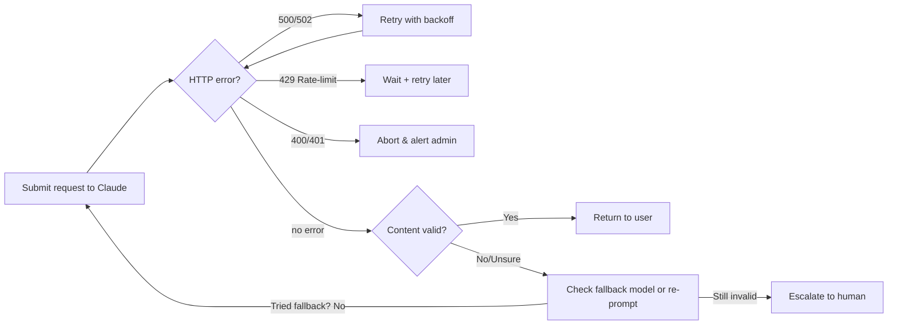

# Domain 5: Context Management & Reliability (15%)

## Executive Summary
Anthropic’s Claude CLI is a command-line interface for interacting with Claude models (Opus, Sonnet, Haiku). This guide covers key best-practices: how to manage Claude’s context window (up to 1,000,000 tokens in Claude 4.6【41†L103-L111】), engineer prompts and context (summarization, rolling windows, “extended thinking” blocks), and design robust escalation and human-in-the-loop (HITL) patterns. We discuss constraints and trade-offs (token limits, latency, cost, model capabilities) and give concrete CLI examples, prompt templates, and decision flows. For example, specify system prompts with `--append-system-prompt`, continue sessions with `-c`, and set a budget with `--max-budget-usd`【47†L209-L218】【47†L218-L224】. We also cover automatic retries (exponential backoff on errors), fallback models (`--fallback-model`)【47†L163-L167】, circuit breakers, and when to escalate to a human reviewer. Security considerations (ZDR, audit logs, IP/tenant restrictions【19†L55-L63】【21†L37-L45】【22†L39-L47】), as well as monitoring metrics (latency, token usage, error rates【29†L58-L62】) are included. Tables compare strategies (e.g. context management techniques, escalation triggers vs actions), and mermaid diagrams illustrate escalation and HITL flows. We assume the latest Claude CLI (circa 2026) unless noted, which supports Sonnet/Opus 4.6 and their 1M-token contexts【41†L103-L111】.  

## Managing Context Windows  
【32†embed_image】Claude’s *context window* is the set of all tokens (user + assistant messages) that the model can reference when generating a response【43†L239-L247】【41†L103-L111】. Larger windows (up to 1M tokens in 4.6) enable processing long conversations or documents, but risk *context rot* (degrading accuracy on very long inputs)【43†L242-L246】. Extended “thinking” blocks (model’s chain-of-thought) are **not** included on subsequent turns – the Claude API automatically strips previous thinking blocks to free up space【43†L290-L293】【53†L915-L923】. To manage context within token limits【10†L223-L228】, common strategies include:  

- **Rolling Window (FIFO)**: Discard oldest exchanges (first-in-first-out) as new ones arrive. Simple to implement (just keep a sliding window of tokens) but loses early context【10†L231-L237】. Useful for chatbots where only recent context matters.  
- **Summarization/Rollup**: Periodically prompt Claude to summarize earlier conversation or documents and include only the summary. This compresses content, preserving key points at lower token cost【10†L231-L237】. (E.g., `claude -p "Summarize the above conversation in 1-2 sentences."`). The trade-off is potential information loss or summary errors.  
- **Context Editing**: Remove or truncate irrelevant info (e.g. old tool outputs) using the CLI or prompts. For example, clear long tool outputs with a command, or ask Claude to drop details it no longer needs【43†L230-L233】.  
- **Retrieval Augmentation**: Store past data externally (e.g. vector DB) and retrieve only relevant snippets into context. This lets you keep context small while still accessing older information. Tools like web search or custom retrieval can be used via the CLI.  
- **Extended Thinking and Tools**: Use Claude’s extended thinking modes. Extended-thinking tokens are billed but then stripped from future context【53†L915-L923】, allowing complex reasoning without accumulating tokens. Combine with tools (e.g. text_editor or code exec) to operate on large content without pulling it entirely into prompt【43†L230-L233】.  

| Strategy              | Pros                           | Cons                                 | Use Case                |
|-----------------------|--------------------------------|--------------------------------------|-------------------------|
| Rolling (FIFO)        | Always recent context          | Forgets earlier context              | Simple chat UIs         |
| Summarization         | Compress history, save tokens  | Potential info loss, overhead of calls| Ongoing tasks, docs    |
| Context Editing       | Precise control of what stays  | Requires logic or manual input       | Tool-driven workflows   |
| Retrieval/Augmented   | Unlimited history external     | Extra system complexity              | Knowledge-base chatbots |
| Extended Thinking     | Deep reasoning, tokens removed | More latency, billing on think blocks| Complex reasoning       |

By mixing these (e.g. use extended thinking plus periodic summarization), you balance token usage, accuracy, and latency. For example, a long-running agent might *server-side compact* logs regularly (Anthropic’s recommended practice)【43†L230-L233】. In practice, you can instruct Claude via CLI to summarize or truncate context: 
```bash
claude -p "Summarize the current conversation so far in up to 100 words, focusing on user goals and outstanding questions."
```
After obtaining the summary, you can clear earlier messages or start a new CLI session with the summary as system context. Use `-c` to continue sessions or `--no-session-persistence` to control context retention【47†L209-L218】. If building your own context pipeline, you might store conversation turns in a log, then feed only the last N turns or a summary back into `claude -p`.  

## Prompt Engineering & State Management  
Clear, structured prompts maximize Claude’s performance【51†L241-L249】. Always provide explicit instructions, few-shot examples, or system messages to guide behavior. For instance, use `--append-system-prompt` to add context or role instructions:  
```bash
claude -p --append-system-prompt "You are a helpful assistant that writes clear bullet-point summaries." "Summarize the above conversation in bullet points."
```  
Anthropic advises using tags (like `<instructions>`, `<context>`) or XML structuring in prompts for complex tasks【51†L295-L303】. Examples and constraints should be embedded as clearly delineated parts of the prompt【51†L275-L283】. 

**State management:** The Claude CLI supports session IDs. By default, your conversation persists in a session; you can resume a session with `-c` or by specifying a `--session-id`【47†L209-L218】. This lets the model remember past exchanges automatically. Use `--no-session-persistence` or start a fresh session when you want to forget history (e.g. new user). 

For very large dialogues, consider *topic-based partitioning*. E.g., split a multi-topic conversation into separate sessions per topic, summarizing and passing only relevant summaries to a new session. A *rolling summary* can be maintained: periodically ask Claude to update a summary of key facts, then use that summary in place of raw history. An example template for rolling summary: 
```
System: "Summarize the conversation so far in [n] points. Each time, replace the old summary with the new one so context stays bounded."
User: (User's message)
Assistant: (Model outputs summary or continues conversation)
``` 
This approach keeps context informative yet compact.

## Escalation & Retry Patterns  
Building robust CLI scripts means handling failures and uncertain outputs gracefully. Common patterns include:

- **Automatic Retries:** On transient API errors (HTTP 500/502/503/529 rate-limit), retry with exponential backoff (e.g. wait 1s, then 2s, up to a cap)【10†L271-L279】. This handles brief outages without user intervention. Limit retries to avoid endless loops.  
- **Circuit Breakers:** Track error rates; if failures exceed a threshold (e.g. 5 errors in a minute), “open” the circuit by pausing requests for some time or switching strategy. This prevents overwhelming a downed service【10†L271-L279】.  
- **Fallback Models:** Use a second model when the primary is overloaded or insufficient. The Claude CLI’s `--fallback-model` flag (print-mode only) automatically switches to a specified model if the default is unavailable【47†L163-L167】【17†L244-L252】. For example: 
  ```bash
  claude -p --model opus --fallback-model sonnet "Explain quantum entanglement in simple terms."
  ```  
  This runs on Opus by default but falls back to Sonnet if Opus is busy. Note: the CLI docs currently indicate `--fallback-model` works only in print (non-interactive) mode【17†L244-L252】, and some Anthropic users report automatic fallback for “Max” plan users. Always verify behavior for your account.  
- **Confidence & Content Checks:** LLMs don’t output true confidence scores, but you can implement proxy checks. For example, prepend “Answer: X. On a scale of 0–100, how confident are you in this answer?” and ask Claude to self-assess. If confidence is low or if the answer contains “hallucination” signals (e.g. “I’m not sure”), escalate. Similarly, use rule-based validators (e.g. numeric ranges) on outputs.  
- **Fallback Prompts:** If an output is incoherent or off-topic, try re-prompting or simplifying the query. For example, if a complex question fails, split it into steps or reduce abstraction.  
- **Human Escalation:** If automated checks fail or for high-stakes requests, route to a human reviewer (see next section).  

A mermaid flowchart of this logic might look like:



**Trade-offs:** Automatic retries improve robustness but add latency and cost; circuit breakers avoid wasteful calls but may delay recovery. Using a smaller fallback model (e.g. Haiku) costs less but may be less accurate. Setting confidence thresholds avoids bad AI output but increases human load. The right parameters depend on your SLAs: e.g. max retry count vs acceptable delay.

## Human-in-the-Loop (HITL) Patterns  
For safety and quality, integrate human reviewers where needed. HITL is essential when outputs affect high-stakes decisions (legal, medical, financial), or when the model’s confidence is low. Key patterns: 

- **Task Routing:** Classify requests by risk or content. For example, flag certain topics (financial/legal advice, personal data) or low-confidence answers for manual review. Otherwise route low-risk queries straight to AI.  
- **Batching & Queues:** Aggregate similar review tasks. E.g., a human moderator might get a queue of N outputs per day, grouped by topic or priority. Batching improves reviewer efficiency (e.g. reviewing 20 summaries in one session).  
- **Approval Dialog:** Use a CLI or web UI where Claude first explains what it intends to do and asks for confirmation (“HITL dialog forging”【11†L5-L12】). For instance, before executing a dangerous operation (like `--permission-mode delegate`), output a summary: “I will edit file X with changes Y. Confirm?”  
- **Roles & SLAs:** Define roles (Prompt Engineer, Reviewer, Admin). Reviewers should have domain expertise to catch errors. Set SLAs like “99% of escalated items reviewed within 4 hours.” Use workflow tools (ticketing, Slack/Teams bots, annotation platforms) to manage tasks.  
- **Audit Trails:** Log every AI-human interaction. Claude’s Compliance API can export audit logs across sessions【19†L55-L63】. Maintain records of decisions: which outputs were approved or edited by humans, along with timestamps and identifiers. This is crucial for traceability and compliance (e.g., SOC 2, HIPAA).  

For example, a simple HITL flow might be: 
```mermaid
flowchart LR
    A[New query or AI output] --> B{Flagged for review?}
    B -- No --> C[Use AI result]
    B -- Yes --> D[Send to human reviewer queue]
    D --> E[Reviewer makes judgement: approve/edit/reject]
    E --> F[Apply (and log) changes]
    F --> C[Use final output]
```
Ensure your system can hand off data to humans easily (e.g. via an admin UI or messaging interface). For code tasks, tools like Pull Request bots with Claude-generated diffs plus human approval can be effective. Annotators might use spreadsheets or annotation tools (Coval or Labelbox) for labeling data. Always document reviewer roles and criteria (e.g. what triggers an escalation), and review the audit trail periodically.

## Monitoring & Observability  
Track these metrics to gauge health and performance:  

- **System Metrics:** Request latency and throughput (requests per second). Monitor infrastructure (CPU/GPU utilization if self-hosted).  
- **API-Level Metrics:** Token usage per request, cost per request (est. from token count and pricing). Monitor error rates (5xx, rate-limit hits).  
- **Quality Metrics:** *Response quality* (e.g. percent of valid answers vs hallucinations). Use automated checks or human scoring to estimate. *Consistency/fairness:* sample outputs for bias or compliance.  
- **User/Usage Metrics:** Number of active sessions, peak concurrency, user satisfaction (via surveys or feedback).  

For example, you might log every Claude response length and time, then set alerts if average latency exceeds a target (e.g. 2 seconds) or if error rate spikes above 1%. Monitor tokens per session to catch runaway usage. Use existing observability tools (Prometheus, Datadog, OpenTelemetry) to capture these and draw dashboards. 

Also log prompt-response pairs (obeying privacy rules) so you can analyze common failures. As one source notes, tracking prompts and responses can identify recurring issues and optimize prompts【29†L71-L79】【30†L152-L161】. *Token monitoring* is particularly important: track tokens per conversation to manage cost and detect abuse【29†L120-L129】. Consider building a specialized LLM monitoring pipeline (e.g. log data into a time-series DB and use vector DB to compare outputs to ground truth embeddings【29†L94-L102】【30†L152-L161】).  

**Key Observability Indicators (examples):**  

- Average/95th%-tile response time  
- 5xx and 4xx error counts (and breakdown)  
- Total tokens used per day and cost per day【41†L103-L111】  
- Number of escalated conversations (HITL events)  
- Model usage splits (what percentage of calls use which model)  
- Uptime and availability (APIs, CLI connectivity)  

Periodically perform **canary tests**: send known test prompts and verify expected output and performance. Use synthetic benchmarks (e.g. Claude’s own Evaluation API) to watch for model degradation over time.

## Security, Privacy & Compliance  
Anthropic provides features to meet enterprise security needs. **API keys** should be stored securely (environment vars like `ANTHROPIC_API_KEY`【47†L337-L343】) and rotated regularly. Use network controls: enterprise plans support *IP allowlisting* and *tenant restrictions* to limit where Claude can be used【21†L37-L45】【22†L39-L47】.  

All data in transit is encrypted. For privacy, use **Zero Data Retention (ZDR)** arrangements if required: Anthropic will not store inputs/outputs after response【43†L222-L224】【23†L58-L66】. Under ZDR or appropriate contracts, Claude does not train on customer data. For HIPAA or similar, Anthropic offers Business Associate Agreements (BAAs) for services (API with ZDR, Claude Enterprise, Claude Code CLI with ZDR)【23†L58-L66】. Note which features are covered: for instance, only ZDR-enabled API and Claude Enterprise chat are BAA-eligible (3rd-party connectors are not)【23†L58-L66】.

For auditability, use the **Compliance API**: you can export chat histories, file content, and audit logs programmatically【19†L43-L52】. This gives a full record of all Claude interactions. Ensure your system logs include user IDs, timestamps, and actions (similar to auditor requirements).  

Define roles and permissions in your organization: e.g. only admins can change CLI model settings or access compliance data. Follow Anthropic’s guidelines and company policies. Check for updates on Claude’s “Responsible Scaling” and security docs (Anthropic trust portal) for the latest compliance commitments.

## Testing & Evaluation  
Continuous testing is crucial. Develop a suite of test prompts with known answers or behaviors. Use automated evaluation metrics on outputs: for example, accuracy (if ground truth exists), BLEU/ROUGE for text tasks, or domain-specific criteria (e.g. exact match for code generation). Use Claude itself or other models to score consistency (e.g. G-Eval【30†L191-L200】).  

Track metrics over time: prompt-response consistency, regression on key examples, and user satisfaction. Perform A/B tests when changing prompts or models. Evaluate performance at different scales (different context lengths, concurrency levels).  

Sample evaluation metrics include: *precision/recall* for classification tasks, *perplexity* or *BERTScore* for generation, *execution success rate* (for code tasks), and human-rated scores for quality. Also measure *throughput* (queries/sec) and resource usage in load tests. Document any deviations and adjust thresholds or retraining accordingly.

## Migration & Scaling  
As use grows, plan to scale and possibly migrate models. Scaling considerations include:  
- **Concurrency:** Increase parallel API calls by running multiple CLI instances or use the Batch API (90% token discount)【41†L103-L111】. Ensure you handle rate limits gracefully.  
- **Multi-Model Strategy:** Route queries to different models by capability and cost. E.g. inexpensive tasks on Haiku 4.5 (fast, $1/ $5 per M tokens) and critical tasks on Opus 4.6 ($5/$25 per M tokens)【41†L103-L111】. You can automate model selection based on prompt complexity or fallback logic.  
- **Load Balancing:** Distribute requests across regions or use retries to an alternative endpoint if available (e.g. Claude on AWS vs local CLI).  
- **Distributed State:** If running multiple CLI agents, ensure session continuity. You might store conversation state in a shared DB.  
- **Upgrades:** When a new Claude version arrives, retrain prompts/templates. For example, migrating from Sonnet 3.7 to Sonnet 4.6 allows larger contexts【41†L103-L111】; adjust your summarization frequency accordingly.  

| Example Deployment Configuration      | Token Budget | Latency Target | Estimated Cost per Call |
|---------------------------------------|--------------|----------------|-------------------------|
| Quick Chatbot Response                | ~2,000 tokens| <500 ms        | ~$0.01 (Sonnet)         |
| Codebase Documentation Summarization  | ~50,000      | <5 s           | ~$0.15 (Opus)           |
| Large Document Analysis (100K tokens) | ~100,000     | <10 s          | ~$0.50 (Opus)           |

*(Costs based on Claude 4.6 pricing: Opus $5/$25 per million tokens; Sonnet $3/$15 per million【41†L103-L111】.)*

In summary, a robust Claude CLI deployment carefully manages context (balancing detail vs cost), uses escalation/fallback to handle failures, incorporates humans for risk mitigation, monitors key metrics, and enforces security/compliance. We have provided templates, examples, and best practices at each stage. By following these patterns—defining clear prompts【51†L241-L249】【51†L275-L283】, partitioning memory, and building fallback/HITL guards—you can maximize Claude’s utility while mitigating its risks.  

**Sources:** Official Claude documentation and engineering resources as cited throughout (Anthropic context guide【43†L226-L233】, Anthropic prompt best practices【51†L241-L249】, independent API guides【10†L231-L239】【10†L271-L279】, and Anthropic compliance/security docs【19†L55-L63】【21†L37-L45】【22†L39-L47】【23†L58-L66】). Merkle diagrams and tables are based on these best practices.