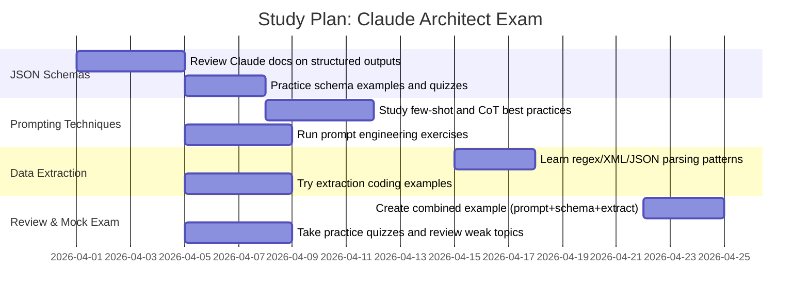

# Domain 3: Prompt Engineering & Structured Output (20%)

**Executive Summary:** This guide covers **JSON Schema outputs**, **few-shot prompt engineering**, and **data extraction patterns**, focusing on Claude/Anthropic best practices. Each section defines the concept, outlines core techniques, lists common pitfalls, and provides concise bullet-point checklists and sample exam questions with answers. We include practical examples—e.g. JSON Schemas tailored to Claude’s *output_config*, few-shot prompt templates (with `<examples>` and `<thinking>` tags), and extraction strategies (regex, parsing, etc.)—plus a combined end-to-end example and a study timeline. All guidance is drawn from Claude API docs and authoritative sources.

## JSON Schemas (Structured Outputs)

**Definition:** A JSON Schema is a declarative template that specifies the structure, types, and constraints of a JSON object. In Claude’s API, using **Structured Outputs (JSON mode)** ensures the model returns *valid, parseable JSON* conforming to the schema【2†L281-L288】. The schema is specified in `output_config.format` with `type: "json_schema"` and a JSON Schema object. Claude’s output will strictly follow this schema (with guaranteed correct types and no parse errors【20†L58-L66】).

**Core Concepts:**
- **Types & Constraints:** JSON Schema supports basic types (`string`, `number`, `boolean`, `array`, `object`) and constraints like `enum`, `minLength`, `format` (e.g. email), and regex `pattern`. For example, a field can have `"type":"string"` and `"pattern":"^[A-Za-z]+$"`. Claude will produce values that match these constraints or fail if impossible【2†L281-L288】.
- **Required vs Optional:**  Use the `"required"` array to list mandatory properties. Omit fields not listed or use `"additionalProperties": false` to disallow unspecified fields. Required fields must appear; optional fields may be absent or null.
- **Nested Objects/Arrays:** Schemas can nest arbitrarily, e.g. an object may have a property that is an array of objects, each with its own schema. Claude will generate nested JSON accordingly.
- **Schema Limitations:** Claude uses a **subset** of JSON Schema (standard with some limitations【25†L330-L338】). For example, property ordering isn’t guaranteed, and certain advanced features (like references or complex `oneOf` clauses) may have limited support. Check Claude’s docs for any restrictions.
- **Type Safety:** When using Structured Outputs or *Strict Tool Use*, Claude guarantees correct types (e.g. `"age": 30` rather than `"30"`)【23†L259-L267】. This avoids the need for custom parsing logic or retries.
- **Error Handling:** If the model cannot satisfy the schema (e.g. no valid output), the response will be type `structured_failure`. Build clients to catch and handle this. With well-formed schemas, failures are rare (see Claude docs).

**Best Practices:**
- **Define Complete Schemas:** Include all expected fields with types and constraints. Use `"additionalProperties": false` to catch unexpected output.
- **Use `enum` for Fixed Options:** For categorical fields, list allowed values with `"enum": [...]`. This guides Claude to valid outputs.
- **Regex Patterns:** Employ `pattern` or format (like `"format":"email"`) to enforce specific formats. Claude will match patterns exactly【2†L281-L288】.
- **Order Independence:** Do not rely on property order (JSON objects are unordered). Use keys, not position.
- **Validate Schema:** Test your schema separately (e.g. with a JSON Schema validator) to ensure it’s valid JSON Schema.
- **Avoid Over-Complexity:** Very large or deeply nested schemas can sometimes confuse the model. Simplify where possible.

**Common Pitfalls:**
- **Missing Required Fields:** If Claude omits a required field, the output is invalid. Double-check `required` lists.
- **Type Mismatches:** Without strict mode, Claude might output a string instead of a number (e.g. `"2"` vs `2`). Use strict/tool mode to prevent that【23†L259-L267】.
- **Hidden Placeholders:** Don’t leave templated placeholders (like `<name>`) in your schema example; the schema itself must be pure JSON.
- **Ambiguous Schemas:** A property with type `"string"` and an email format should not allow numbers, but if Claude can’t produce an email it may fail. Ensure the schema truly matches realistic output.
- **Schema Validation:** Always handle possible exceptions when parsing Claude’s output (even though errors should be rare in JSON mode).

**Example JSON Schema (Claude):**
```jsonc
{ 
  "type": "object",
  "properties": {
    "name":     { "type": "string", "minLength": 1 },
    "email":    { "type": "string", "format": "email" },
    "age":      { "type": "integer", "minimum": 0 },
    "country":  { "type": "string", "enum": ["US", "CA", "GB", "AU"] }
  },
  "required": ["name","email"],
  "additionalProperties": false
}
```
This schema enforces a non-empty name, a valid email, a non-negative age (integer), and an optional country chosen from a set. Claude will output JSON like `{"name":"John Smith","email":"[email protected]","age":35}` to satisfy it【2†L281-L288】.

**Checklist – JSON Schema:**
- Define `"type"` for each property (object, string, number, etc.).
- List all mandatory fields in `"required"`.
- Use `"format"` (email, uri, date) and `"pattern"` for strings needing a format.
- Use `"enum"` for fixed sets of allowed values.
- Set `"additionalProperties": false` to catch typos.
- Use nested schemas for arrays/objects and `items` keyword for arrays.
- Validate schema length and complexity; Claude can handle moderately complex schemas but test first.
- Rely on Claude’s compliance: no need to add text-based instructions about format.
- Remember Claude’s guaranteed schema compliance avoids JSON parse errors【20†L58-L66】.

**Sample Questions (JSON Schemas):**
1. **(MC)** In a Claude JSON schema, what is the effect of `"additionalProperties": false`?  
   A) It allows extra fields beyond those listed.  
   B) It prevents any fields outside `properties` from appearing.  
   C) It requires all properties to be present.  
   D) It automatically fills missing fields with null.  
   **Answer:** B. It forbids any keys not explicitly defined in `properties`.

2. **(MC)** Which JSON Schema feature enforces that a field’s value is one of a fixed set?  
   A) `enum`  
   B) `pattern`  
   C) `format`  
   D) `required`  
   **Answer:** A (`enum`).

3. **(Short Answer)** In Claude’s Structured Outputs mode, if a schema requires `{"age": "integer"}` but Claude returns `"age": "30"`, what can you do to fix this?  
   **Answer:** Enable strict tool use or ensure the schema enforces an integer type. With `strict: true` on a tool, Claude will output `30` instead of `"30"`. Alternatively, clarify the prompt to output numeric values.

4. **(MC)** Which of these is *not* a supported JSON Schema data type?  
   A) `boolean`  
   B) `date`  
   C) `array`  
   D) `number`  
   **Answer:** B. JSON Schema does not have a built-in `date` type (dates use string with `format`).

5. **(MC)** If a field is not listed in the schema’s `properties` and `additionalProperties` is true (default), what happens?  
   A) Claude will always omit that field.  
   B) Claude may include an extra field, since it’s not prohibited.  
   C) Claude will error out.  
   D) Claude will ignore any prompt requesting that field.  
   **Answer:** B.

6. **(Short Answer)** What does the `"required": ["name","email"]` line enforce in a JSON schema?  
   **Answer:** It mandates that the output JSON must include both `name` and `email` fields (cannot be omitted).

7. **(MC)** True or False: Claude guarantees the JSON output keys will be in the same order as in the schema.  
   **Answer:** False. JSON objects are unordered; key order is not guaranteed.

8. **(MC)** Which parameter should you set in the Claude API call to get JSON schema output?  
   A) `mode: "json"`  
   B) `output_config.format: {...}`  
   C) `instructions: "Return JSON"`  
   D) `schema_mode: true`  
   **Answer:** B. Use `output_config.format` with `"type": "json_schema"` as shown in Claude docs.

9. **(MC)** Why might you get a `structured_failure` response when using JSON outputs?  
   A) The model hallucinated new values.  
   B) The output JSON didn’t fully match the schema (schema violation).  
   C) The API key is invalid.  
   D) Claude doesn’t support JSON.  
   **Answer:** B. It indicates Claude could not generate valid JSON per the schema.

10. **(Short Answer)** Name two constraints you might put on a string field in a JSON schema to ensure it is an email address.  
   **Answer:** Use `"format": "email"` and a pattern like `".+@.+\\..+"`, or just the email format (Claude supports common formats).

## Few-Shot Prompting

**Definition:** Few-shot prompting (also *multishot* or *n-shot* prompting) means including a few demonstration examples in your prompt to **guide** the model’s response. Each “shot” is an input-output example. This is a form of in-context learning. As Anthropic notes, examples are one of the most reliable ways to steer Claude’s output format, tone, and structure【6†L275-L283】. Even 1–3 relevant examples can dramatically improve accuracy and consistency over zero-shot prompts【6†L275-L283】【41†L51-L59】.

**Core Concepts:**
- **Instruction Framing:** Clearly instruct Claude what you want. Break tasks into steps or bullet points if needed. Use a system prompt (e.g. `system: "You are a helpful assistant"` or a role) to set context.
- **Examples:** Provide input-output pairs wrapped in tags. Claude docs recommend using `<examples>` and `<example>` tags to delineate them from instructions【6†L275-L283】. For instance:  
  ```xml
  <examples>
    <example>
      User: List colors for animals in a sentence.  
      Assistant: The elephant is gray. The frog is green.
    </example>
    <example>
      User: List foods in a sentence.  
      Assistant: I like pizza and ice cream.
    </example>
  </examples>
  ```
  Good examples should be **relevant** to your task and **diverse** enough to cover edge cases【6†L275-L283】. Typically include **3–5** examples for best results【6†L287-L290】.
- **Example Selection & Ordering:** Choose examples that closely resemble your actual use case. You may start with a simple case and include harder ones. Order can be chronological (first, second, etc.) or from easiest to hardest. Avoid giving conflicting patterns. Wrap them in `<examples>` to signal “here are demo interactions.”
- **Positive vs Negative Examples:** By default, examples are *positive demonstrations* of correct behavior. Claude can also learn from “negative” examples of what *not* to do. The Anthropic tutorial notes: *“examples of how you want it to behave (or how you want it **not** to behave) is extremely effective”*【41†L51-L59】. To use a negative example, label or tag it clearly (e.g. “Example (BAD): ...”).
- **Prompt Templates:** Common few-shot templates include:
  - **Chain-of-Thought (CoT):** Provide examples where the answer includes reasoning steps inside `<thinking>` tags【8†L685-L693】. Claude will mimic that style and produce its own thought process before the answer. For instance:  
    ```xml
    <thinking>To solve, first break down the problem ... </thinking>  
    <answer>The result is 42.</answer>
    ```
  - **Concise Answers:** If you want a brief final answer, show examples without internal reasoning or explicitly instruct “Answer concisely.” Claude’s latest models default to a more concise style【6†L378-L386】.
  - **Formatting Examples:** Show complete examples of the final output format. Claude can often *extrapolate* formatting rules from a few correct outputs【41†L78-L86】. As one tutorial notes, *“we could just provide Claude with some correctly-formatted examples and Claude can extrapolate from there.”*【41†L78-L86】
- **Parameters Guidance:** Use model parameters wisely. A lower `temperature` (~0–0.3) makes outputs more deterministic (important for exam consistency), while higher values (~0.7) add creativity (less reliable for precise tasks). Claude’s API uses a `temperature` or `top_p`/`top_k` parameters like other LLMs. Usually, keep `temperature` low when examples require exact format. Claude also supports an explicit `thinking` parameter: if `thinking=true`, it provides chain-of-thought reasoning by default (with the model chosen).

**Best Practices:**
- **Structure with XML Tags:** As Claude docs recommend, wrap different parts of your prompt in tags (e.g. `<instructions>`, `<input>`, `<example>`) to avoid ambiguity【6†L295-L304】. This helps Claude parse the prompt reliably.
- **System Role:** Use a system message like `"system": "You are a helpful assistant..."` to fix tone or role【6†L310-L319】.
- **Clarity & Directness:** Explicitly state the task and desired format. Use lists for steps and be precise. Claude follows clear instructions best【6†L241-L250】.
- **Context and Motivation:** Brief context can improve relevance. E.g. “We need this to summarize the report for executives.”
- **Example Diversity:** Include at least one challenging or edge-case example so Claude doesn’t overfit trivial cases【6†L281-L288】.
- **Self-Evaluation Prompt:** You can append a request like “Before you finish, verify your answer” to catch mistakes【8†L685-L693】.
- **Positive/Negative Balance:** If showing a negative example, clearly label it. For instance:  
  ```xml
  <example>
    User: Translate to French.  
    Assistant (GOOD): Je suis heureux.  
    Assistant (BAD): I am happy.  <!-- Wrong language -->
  </example>
  ```
  This signals what *not* to do.

**Common Pitfalls:**
- **Too Many Examples:** Overloading with examples can confuse Claude or hit the token limit. Stick to 3–5 high-quality examples【6†L287-L290】.
- **Irrelevant Examples:** Examples should mirror the actual task. Irrelevant or out-of-domain examples may mislead.
- **Unstructured Prompts:** Writing examples directly in text without tags can cause misinterpretation. Always label examples or use `<examples>`.
- **Forgetting the Query:** If examples look nothing like the query, Claude may ignore them. Ensure the style matches the final question.
- **Over-reliance on Format:** Examples drive format, but also ensure the instructions themselves ask for that format (e.g. “List the items in JSON array”).

**Checklist – Few-Shot Prompting:**
- Include **3–5** clear examples in `<examples>` tags【6†L275-L283】.
- Ensure examples are **relevant**, **diverse**, and **correct**【6†L275-L283】.
- Wrap instructions vs examples vs user input in distinct tags (e.g. `<instructions>`, `<input>`, `<example>`).
- Use a **system role** to define Claude’s purpose (tone, expertise)【6†L310-L319】.
- Explicitly request the desired format (e.g. “Output should be a JSON array”).
- Consider **chain-of-thought**: If detailed reasoning is needed, instruct Claude to “think step-by-step” or use `<thinking>` tags in examples【8†L685-L693】.
- Use **negative examples** sparingly and clearly to show undesired output【41†L51-L59】.
- Adjust **temperature**: Lower values for consistency in format. Use `thinking` parameter or prompts for reasoning when needed.

**Sample Questions (Few-Shot):**
1. **(MC)** What is “few-shot” prompting?  
   A) A method where the model is fine-tuned on a small dataset.  
   B) Providing a few input-output examples in the prompt.  
   C) Using one example in the prompt.  
   D) Running the model multiple times with different seeds.  
   **Answer:** B.

2. **(MC)** In Claude prompts, examples should be wrapped in which tags for best practice?  
   A) `<code>`  
   B) `<examples>` and `<example>`  
   C) `<input>`  
   D) `#begin`  
   **Answer:** B【6†L275-L283】.

3. **(MC)** True or False: Few-shot examples must always be formatted as complete, correct output to be effective.  
   **Answer:** True (effectiveness relies on correct demos).

4. **(Short Answer)** Why might you include a `<thinking>` tag in your examples?  
   **Answer:** To demonstrate chain-of-thought reasoning. Claude will then mimic that reasoning style in its response【8†L685-L693】.

5. **(MC)** Which strategy could improve accuracy for complex reasoning tasks?  
   A) Removing all examples.  
   B) Adding irrelevant details.  
   C) Providing step-by-step examples or enabling extended thinking.  
   D) Setting `temperature` to 1.0.  
   **Answer:** C (chain-of-thought via examples or `thinking=true`).

6. **(MC)** If Claude is returning irrelevant info, what might be wrong?  
   A) Too high temperature.  
   B) Examples are not relevant or missing tags.  
   C) The prompt is too short.  
   D) The model version is outdated.  
   **Answer:** B. Irrelevant examples or lack of clear structuring can confuse outputs.

7. **(Short Answer)** How can you explicitly instruct Claude to output concisely?  
   **Answer:** Tell Claude to be brief or instruct it “Answer in one sentence” (or similar). By default Claude is fairly concise, but explicit instructions or tags can enforce brevity.

8. **(MC)** To signal a “negative” example, you might:  
   A) Prefix with “BAD:” or label it.  
   B) Use `<bad_example>` tags.  
   C) Exclude it from the prompt.  
   D) None; negative examples aren’t used.  
   **Answer:** A. Annotating it or labeling helps Claude recognize it’s an example of what **not** to do【41†L51-L59】.

9. **(Short Answer)** How does adding examples compare to adding natural language instructions?  
   **Answer:** Examples often have a stronger effect on output style and accuracy than just instructions; they show *exactly* what is expected【6†L275-L283】.

10. **(MC)** The term “n-shot” in prompting refers to:  
    A) Number of tokens used.  
    B) Number of examples included.  
    C) Number of times the model outputs.  
    D) The model version.  
    **Answer:** B.

## Data Extraction Patterns

**Definition:** Data extraction patterns are methods to pull structured information from text or unstructured input. This includes techniques like **regex matching**, **JSON parsing**, **key-value extraction**, **table parsing**, and **entity recognition**. In NLP, patterns might also use LLM-driven parsing or schema-based extraction. Claude’s structured output and few-shot capabilities can be used to extract entities or table data with high accuracy.

**Core Concepts:**
- **Regex Extraction:** Use regular expressions to match patterns in text (e.g. emails, dates). For example, `re.search(r"\b[A-Za-z0-9._%+-]+@[A-Za-z0-9.-]+\.[A-Za-z]{2,}\b", text)` finds email addresses.
- **Key-Value Parsing:** Many documents format data as “Key: Value” pairs. Split lines at `:`, trim whitespace, and map keys to values. This is simple and robust if the format is consistent.
- **JSON or XML Parsing:** If data is already in JSON/XML, use a parser (e.g. `json.loads()`) to extract fields directly. Claude’s JSON mode can output structured data ready for parsing.
- **Table Extraction:** For tabular data (CSV, TSV, Markdown tables, HTML tables), use a dedicated parser (e.g. Pandas for CSV/Excel, BeautifulSoup for HTML tables). Tools or libraries can convert tables into structured lists or records.
- **Entity Extraction:** Use Named-Entity Recognition (NER) to identify persons, dates, locations, etc. Libraries like spaCy can tag entities. For example, extracting all dates with spaCy’s `doc.ents` or with regex like `\b\d{4}-\d{2}-\d{2}\b`.
- **Schema Mapping:** Map extracted values to a predefined schema. For instance, if you need `{"price": ..., "date": ...}`, assign each found value to the correct schema field. LLMs can assist by outputting JSON matching a schema.
- **LLM-Assisted Extraction:** You can prompt Claude with extraction tasks, e.g. “Extract all phone numbers from the text into a JSON list.” Claude often excels at in-context extraction when guided with examples or schema.

**Common Patterns:**  
- **Pattern Recognition:** Detect repeating textual patterns and structure them. Example from research: from “Car 1 is yellow. Car 2 is blue…”, output could be `Car: 1, Color: Yellow; ...`【32†L75-L83】.  
- **Keyword Extraction:** Identify salient terms. For instance, given a sentence about black holes, output the keywords “black holes, regions, space, gravitational pull”【32†L75-L83】.  
- **Relation Extraction:** Identify relationships between entities. E.g. “Paris is the capital of France” → `(Paris, capital_of, France)` or plain text “Paris – is the capital of – France.” These approaches leverage pattern matching or LLM reasoning.

**Error Handling & Ambiguity:**
- Plan for missing or malformed data. For example, if a regex match fails, either return `null`/empty or have the LLM output a placeholder (e.g. `{"field": null}`).
- For ambiguous inputs, define a strategy: either choose the most likely interpretation, ask Claude to list options, or refine the prompt (“If multiple matches, choose the first.”).
- Validate extracted values (e.g. if expecting an email, check with regex or a validator).
- If using Claude, consider adding examples of both successful and “no match” cases (e.g. demonstrate what output to produce when a value is absent).

**Best Practices:**
- **Test Regex Thoroughly:** Write unit tests for your regex and edge cases (e.g. different date formats, currency symbols). Avoid overly greedy patterns.
- **Use LLM for Complex Patterns:** When rules get complicated, a few-shot LLM prompt or JSON schema can simplify extraction (e.g. structured outputs mode to parse a paragraph).
- **Normalize Data:** Post-process extracted text (trim spaces, convert cases, parse numbers) to fit your schema.
- **Table Parsing:** Use libraries (e.g. `pandas.read_csv`) instead of crafting your own parser, unless formats vary widely.
- **Entity Libraries:** For names/dates, use established NLP libraries (spaCy, NLTK). Use Claude for more nuanced extraction if needed.
- **Audit and QA:** Always review a sample of extracted results to catch errors.

**Example – Regex Pattern:** To extract phone numbers in format `(xxx) xxx-xxxx` from text:  
```python
import re
match = re.search(r"\(\d{3}\)\s*\d{3}-\d{4}", text)
if match:
    phone = match.group(0)
```

**Checklist – Data Extraction:**
- Determine the extraction method by data type: text (regex), structured (parser), table (CSV/HTML parser), entities (NER).
- For each field, **define a pattern or schema**. Document patterns (e.g. date format) clearly.
- Use existing libraries/tools where possible (JSON parsers, CSV readers).
- Handle multiple occurrences (e.g. use `findall` in regex or loop through table rows).
- Include validation (e.g. numeric range checks, membership tests for enums).
- Prepare for missing/ambiguous data: define defaults or error states.
- Consider using Claude’s JSON mode for messy input: e.g. ask “Find person, email, and company in the text.”

**Sample Questions (Data Extraction):**
1. **(MC)** Which method is best for extracting all email addresses from a string?  
   A) JSON parsing  
   B) Regular expressions  
   C) XML parser  
   D) Machine learning classification  
   **Answer:** B (regex like `\b[\w.-]+@[\w.-]+\.\w+\b`).

2. **(MC)** If you have a CSV string, how could you extract data programmatically?  
   A) Use string `split(",")` only.  
   B) Use `json.loads()`.  
   C) Use a CSV parser (e.g. Python’s `csv` or Pandas).  
   D) LLM few-shot examples.  
   **Answer:** C. A CSV-specific parser handles quoting, newlines, etc.

3. **(MC)** Which library is well-suited for Named Entity Recognition (people, dates, places)?  
   A) Pandas  
   B) spaCy  
   C) re (regex)  
   D) SciPy  
   **Answer:** B (spaCy has built-in NER).

4. **(Short Answer)** You extract a numeric field using regex but get a string `"45"` instead of number `45`. How might you correct this?  
   **Answer:** Convert to int (e.g. `int("45") = 45`) after extraction. Or ensure the JSON schema requires an integer so Claude (or code) outputs it as a number.

5. **(MC)** In a prompt pipeline, why might you prefer an LLM with a JSON schema to regex alone?  
   A) LLMs never make mistakes.  
   B) Schemas can capture nested or contextual data that simple patterns miss.  
   C) Regex is always slower.  
   D) LLMs don’t require testing.  
   **Answer:** B.

6. **(Short Answer)** What strategy can you use if an input text has **two possible formats** for a date (e.g., “YYYY-MM-DD” or “MM/DD/YYYY”)?  
   **Answer:** Either use two regex patterns and pick matching one, or normalize text first, or instruct Claude to recognize both. For example, use `|` in regex: `(\d{4}-\d{2}-\d{2}|\d{2}/\d{2}/\d{4})`.

7. **(MC)** What is the role of “schema mapping” in data extraction?  
   A) Visualizing data.  
   B) Aligning extracted values to a target data schema.  
   C) Encrypting sensitive fields.  
   D) Removing irrelevant keys.  
   **Answer:** B.

8. **(MC)** When extracting data from an HTML table, which tool/library might you use?  
   A) HTML parser (BeautifulSoup, lxml) or Pandas’ `read_html`.  
   B) PIL (image library).  
   C) SciPy FFT.  
   D) Regular expressions exclusively.  
   **Answer:** A.

9. **(Short Answer)** After extracting fields, what is one common post-extraction step?  
   **Answer:** Data type conversion or normalization (e.g. trim whitespace, convert strings to numbers, unify date formats).

10. **(MC)** To handle ambiguous extraction (e.g. two dates appear, which is correct?), you might:  
    A) Randomly pick one.  
    B) Use additional context or ask the user/LLM to clarify.  
    C) Ignore the problem.  
    D) Default to the first.  
    **Answer:** B (define rules or query user/LLM).

## Integrated Example & Pipeline

**Scenario:** Extract user contact info from a free-text message and output structured JSON. We will define a JSON schema, craft a prompt with examples, and show the extraction pipeline.

**Schema Definition (JSON):**
```json
{
  "type": "object",
  "properties": {
    "name":    { "type": "string" },
    "email":   { "type": "string", "format": "email" },
    "phone":   { "type": "string", "pattern": "^\\(\\d{3}\\)\\s*\\d{3}-\\d{4}$" }
  },
  "required": ["name","email"],
  "additionalProperties": false
}
```
This schema specifies that output must be an object with `name` (string), `email` (string in email format), and optional `phone` matching the pattern `(123) 456-7890`. Only `name` and `email` are required.

**Few-Shot Prompt (with JSON schema mode):**
```
<instructions>Extract contact info from the user message into JSON format as defined by the schema.</instructions>

<examples>
<example>
User: My name is Alice Johnson, email is alice@example.com, call me at (415) 555-7890.
Assistant: {"name":"Alice Johnson","email":"[email protected]","phone":"(415) 555-7890"}
</example>
<example>
User: Please note, Bob Lee (bob.lee@mail.com) is joining.
Assistant: {"name":"Bob Lee","email":"[email protected]","phone":""}
</example>
</examples>

<input>User: Hi, this is Charlie Kim, email charlie.kim@domain.org.</input>
<output_format>{JSON_SCHEMA}</output_format>
```
- The prompt uses `<instructions>`, two `<example>` pairs showing the user message and expected JSON (with keys sorted arbitrarily).
- In the second example, no phone is given, so `"phone":""` (or `null`) could be used.
- We inserted `{JSON_SCHEMA}` as a placeholder where the actual JSON schema JSON would be inserted into `output_format`. (In code, you’d pass the schema string to `output_config.format`).
  
**Claude’s Response:** In JSON mode, Claude will output something like:
```json
{"name":"Charlie Kim","email":"[email protected]","phone":""}
```
This matches the schema (no phone provided). Claude respects the schema: it outputs valid JSON with correct types and an empty string for the omitted phone.

**Extraction Pipeline (Python-style):**
```python
# 1. Define schema and prompt (as above, injecting the JSON Schema).
schema = {...}  # the JSON schema dict from above
prompt = "<instructions>...<output_format> ...<examples>...</examples> <input>...</input>"

# 2. Call Claude with JSON output mode.
response = client.messages.create(
    model="claude-opus-4-6",
    messages=[{"role":"system","content":"You are a data-extraction assistant."},
              {"role":"user","content": prompt}],
    output_config={"format": schema}
)

# 3. Parse the JSON output.
result = json.loads(response["completion"]["data"]["content"])
name = result["name"]         # e.g. "Charlie Kim"
email = result["email"]       # e.g. "[email protected]"
phone = result.get("phone","")  # e.g. "" (empty if none)

# 4. Validate and use the data.
print(f"Name: {name}, Email: {email}, Phone: {phone or 'N/A'}")
```
**Annotated Steps:**
- *Define Schema & Prompt:* We create a JSON schema dict and construct a Claude prompt including instructions, `<examples>`, and `<input>`.
- *Call Claude:* Use the API with `output_config.format = schema` to enforce output. Claude returns a JSON-parsable string.
- *Parse JSON:* Load the JSON into a Python dict (no parse errors occur because the schema was enforced【20†L58-L66】).
- *Post-process:* Extract fields, handling any missing ones (e.g. treat empty string as missing phone).

This pipeline ensures **zero parsing errors** thanks to Claude’s structured output mode【20†L58-L66】, and the output exactly matches our schema.

## Tables of Techniques

**Prompting Strategies Comparison:**

| Strategy           | Description | Pros | Cons |
|--------------------|-------------|------|------|
| **Zero-shot**      | No examples; only instructions. | Simple to write. Works if clear. | Lower accuracy on complex tasks. (Often needs many instructions.) |
| **Few-shot**       | Provide *n* examples of input→output in prompt【6†L275-L283】. | Guides model with examples; improves accuracy and format consistency【6†L275-L283】. | Longer prompt; risk of context overflow; picking poor examples can mislead. |
| **Chain-of-Thought** | Demonstrate step-by-step reasoning (via `<thinking>` or explicit “think through”). | Helps with multi-step problems, reasoning transparency【8†L685-L693】. | Increases verbosity; may not be needed for simple tasks; can distract if not needed. |
| **XML Tagging**    | Wrap prompt sections (`<context>`, `<input>`, `<example>`) in tags【6†L295-L304】. | Reduces ambiguity, improves parsing of complex prompts. | More formatting overhead; requires consistency. |
| **System Role**    | Use system message to set tone/role. | Focuses style (e.g. “You are a doctor...”); improves relevance【6†L310-L319】. | If role is mis-specified, output may be off-tone. |

**JSON Schema Features:**

| Feature          | Purpose                                         | Notes/Support                                             |
|------------------|-------------------------------------------------|-----------------------------------------------------------|
| `type`           | Data type (string, integer, boolean, object, array) | Claude supports basic types; mismatches cause errors.     |
| `properties`     | Defines object keys and their schemas.          | All keys must be defined (if `additionalProperties:false`). |
| `required`       | Lists mandatory fields.                         | Must appear in output.                                    |
| `enum`           | Restricts value to a fixed list.                | Claude will only output listed values.                    |
| `pattern`        | Regex the string must match.                    | Useful for formats (phone, code).                         |
| `format`         | Predefined formats (email, uri, date).          | Commonly used for emails, URLs; Claude enforces it.       |
| `items` (array)  | Schema for array elements.                      | Use for lists (e.g. `"type":"array","items":{...}`).       |
| `additionalProperties` | Allow/disallow extra fields.             | `false` disallows any unspecified field (prevents typos). |

**Data Extraction Methods:**

| Method            | Use-Case / Description                               | Pros                                      | Cons                                           |
|-------------------|------------------------------------------------------|-------------------------------------------|------------------------------------------------|
| **Regex**         | Pattern matching in raw text (emails, dates, IDs).   | Very precise for known formats.           | Hard to cover all cases; prone to false matches. |
| **Key-Value Parsing** | Lines like `Key: Value`.                        | Simple and fast for well-structured text. | Fails if format is inconsistent or nested.     |
| **JSON/XML Parsing** | Already structured data.                         | Directly load into objects (no guesswork).| Requires valid JSON/XML input.                 |
| **Table Parsing** | Extracting columns/rows from tables or CSVs.         | Library support (Pandas, csv module).     | Complex if table formatting varies.            |
| **NER / Entity Extraction** | Identify names, dates, locations, etc. | Captures entities without defined regex. | May mislabel or miss context (needs ML model). |
| **LLM-based (Schema)** | Prompt LLM to output structured data per schema. | Highly flexible; captures context.         | Depends on prompt quality; slower.             |

## Study Plan (Timeline)



*(Dates are illustrative: adjust for your schedule.)*

**Key References:** Official Claude/Anthropic docs on **Structured Outputs**【2†L281-L288】, **Prompting Best Practices**【6†L275-L283】【8†L685-L693】, and relevant research on data extraction【32†L75-L83】. These sources underpin the definitions and tips provided above.