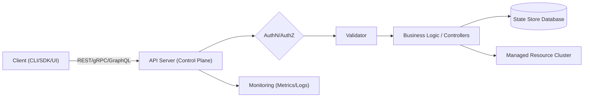

# Domain 4: Tool Design & MCP Integration (18%)

## Executive Summary

Managed Control Planes (MCPs) are centralized management layers in cloud-native, distributed systems.  They handle tenant onboarding, resource provisioning, and lifecycle events across workloads.  In practice, an MCP comprises an API server (REST/gRPC/GraphQL), controllers/business logic, and a backing data store.  Clients interact via APIs, CLIs/SDKs, or web UIs.  Designing MCP interfaces requires careful choice of protocol (e.g. REST, gRPC, GraphQL), versioning strategy, and idempotency handling.  Robust error handling (using standardized schemas like RFC 7807 **Problem Details** or GraphQL error objects) and clear retry/circuit-breaker policies are critical.  Multi-tenant isolation is enforced via scoping models – e.g. separate namespaces or dedicated control planes per tenant – plus RBAC, quotas and network policies.  Security (OAuth2, mTLS), performance (horizontal scaling, caching), and operational excellence (monitoring, logging, tracing) must be baked in.  We provide example OpenAPI/gRPC interface snippets, error JSON/YAML formats, and policy samples.  Comparison tables summarize API protocols, error schemas, and tenant scoping models.  Actionable recommendations and a migration checklist conclude this report.

# Definitions and Scope of MCP

A **Managed Control Plane (MCP)** is the central control layer that manages resources and operations across tenants in a distributed system.  It is distinct from the **data plane** (the runtime workload cluster) and is responsible for high-level tasks such as tenant onboarding, configuration, scaling, and policy enforcement.  For example, Microsoft notes that a multitenant control plane “onboards new tenants, creates databases for each tenant, and performs other management and maintenance operations”.  In cloud environments, the MCP might encompass RESTful APIs, CLI tools, SDKs, and dashboards for users to interact with services declaratively.  

Open-source frameworks like CNCF’s Crossplane describe control planes as **self-healing, declarative interfaces** that provide “a single point of control for policy and permissions,” enabling engineering teams and automation agents to self-service via API.  Similarly, Kubernetes itself has a control plane (API server, controllers, etc.) that schedules pods and reconciles system state.  In this context, an MCP could be thought of as a cloud-native control plane stack (APIs + controllers + store) that manages multi-tenant resources.

MCPs can be implemented for SaaS products, internal platforms, or multi-cluster orchestration.  Their scope typically includes **resource management** (provisioning VMs, storage, network), **configuration** (updating shared resources when tenants change), **tenant lifecycle** (onboard/offboard), and **telemetry/consumption tracking**.  As Azure’s guidance emphasizes, even if an early system has few tenants and relies on scripts, growth warrants a robust control plane to automate repeated tasks.  

# MCP Components and Interfaces

A typical MCP consists of: 

- **API Layer:** A server offering programmatic interfaces (REST/gRPC/GraphQL) for clients and internal components.  For example, Kubernetes’ API is *resource-based* and RESTful over HTTP.  The MCP’s API defines resources, methods, and data schemas (often via OpenAPI or protobuf/gRPC descriptors). 
- **Controllers/Logic:** Background services (controllers, workers, or reconcile loops) that handle resource changes, orchestrate actions, and interact with the data plane.  These implement the business logic of the control plane.  
- **State Store:** A database or etcd cluster that holds MCP state (configuration, status, inventories).  All controllers persist state here.  
- **User Interfaces:** Clients that invoke the MCP’s APIs – this includes CLIs/SDKs (e.g. `kubectl` or cloud-provider CLIs like AWS CLI/Azure CLI), third-party SDKs (e.g. `client-go`), and web UIs or dashboards.  For example, Kubernetes offers a dashboard and `kubectl` which both call the API server.  

Below is a high-level architecture flow for a typical MCP (names and components are illustrative):



As shown, clients (CLI/SDK/UI) send requests to the MCP’s API server.  The request is authenticated/authorized, then validated and passed to controller logic.  Controllers read/write the state store and drive changes in the data plane (actual clusters or services).  Observability hooks (metrics/logging) are emitted by the API server and controllers.  This flow ensures a clear separation between interface, control, and data layers.

Each interface has different characteristics:

- **REST/HTTP:** Ubiquitous, human-readable (JSON), language-agnostic, and firewall-friendly.  Resource names and actions map to HTTP verbs (GET/POST/PUT/PATCH/DELETE) as in Kubernetes’ APIs.  Versioning is often done via URL (e.g. `/v1/`), content types, or headers.  
- **gRPC (HTTP/2+Protobuf):** High-performance binary protocol with code generation. Supports streaming and multi-language stubs. gRPC is ideal for internal service-to-service communication where performance matters.  However, browser support is limited (gRPC-Web), and payloads are not human-readable.  
- **GraphQL:** Single-endpoint query API where clients specify desired data shape. Useful for complex, client-driven queries and when minimizing over-fetch is important. The response format is JSON, but GraphQL has its own query grammar. There is no built-in versioning – fields are deprecated over time.  
- **CLI/SDK:** Many MCPs provide a CLI (e.g. `kubectl`, `aws`, `az`) and language-specific SDKs. These are essentially API clients that offer user-friendly commands or functions. The CLI/SDK layer may implement best practices like pagination, retries, and version negotiation internally.  
- **Web UI/Portal:** Web dashboards call the same APIs but present a graphical interface. Security (CSRF, CORS, OAuth flows) and full client-side logic (caching, query batching) come into play here.

> **Table: API Protocol Comparison**

| Aspect         | REST (HTTP/JSON)        | gRPC (HTTP/2+Protobuf)         | GraphQL (HTTP/JSON)          |
|---------------|-----------------------------------------|-----------------------------------------------|--------------------------------------------|
| **Data Format**     | Flexible (JSON, XML, etc.)           | Binary (Protocol Buffers)                     | JSON (GraphQL queries/responses)           |
| **Performance**     | Moderate; easy to cache            | High (compact encoding, HTTP/2) | Moderate; avoids over-fetch but single endpoint |
| **Versioning**      | Explicit versions (URLs/headers)  | Via service definition (package names)        | No built-in; deprecate fields             |
| **Streaming**       | No (except via chunking or websockets) | Supports streaming (server/client/bidi) | Not natively (federations use subscriptions) |
| **Browser Support** | Native (HTTP)                     | gRPC-Web (HTTP/1.1 with limitations) | Native (HTTP, typically via JS client)   |
| **Tooling**         | Mature (OpenAPI, Swagger, codegen) | Built-in codegen in many languages            | Schema introspection, type system        |
| **Use Cases**       | Public APIs, CRUD interfaces | Internal microservices, high-throughput RPC | Client-driven data queries                |
| **Security**        | OAuth2/JWT, API keys, TLS        | TLS by default; uses metadata for auth       | HTTP mechanisms; tokens (often same as REST) |

*Sources:* Kubernetes API docs, Baeldung gRPC comparison.

# Interface Design Best Practices

When designing MCP APIs, follow industry-proven patterns:

- **Use Consistent Versioning:** Adopt semantic API versioning. For REST, version via URI (e.g. `/api/v1/resource`) or content negotiation. For gRPC, use package namespaces or service names to indicate major versions. GraphQL typically avoids versions by evolving the schema and deprecating fields. **Breaking changes must always be versioned**. Ensure servers can handle old and new clients gracefully (e.g. respond with a “SupportedVersion” condition). 

- **Idempotency and Retry:** Design safe and idempotent methods. In HTTP, GET, PUT, DELETE, and HEAD are defined as idempotent (repeating the request yields the same result). POST/PATCH are not idempotent by default. For non-idempotent endpoints (e.g. create operations), implement idempotency keys or unique tokens so clients can safely retry without duplicate side-effects (see IETF *Idempotency-Key* header draft). In gRPC, document whether each RPC is idempotent; clients should retry idempotent calls on transient failures with backoff. Always use **exponential backoff with jitter** to avoid thundering herds. Consider a circuit breaker (e.g. Resilience4J, Envoy) to stop calling a flapping service. 

- **Authentication & Authorization:** Enforce strong authN/authZ. Use OAuth2/OpenID Connect (RFC 6749) tokens or mTLS for client authentication. Each API call should carry a bearer token or client certificate. Apply RBAC or ABAC at the control plane to ensure users can only act within their scope. For example, Kubernetes emphasizes namespace-scoped Roles: “Assign permissions at the namespace level where possible. Use RoleBindings (not ClusterRoleBindings) to give users rights only within a specific namespace”. 

- **Rate Limiting & Throttling:** Protect the MCP from abuse. Apply rate limits per tenant or user (e.g. API gateway limits). AWS EKS notes that the API server may throttle incoming requests to prevent overload. Choose fair scheduling (e.g. K8s [API Priority & Fairness](https://kubernetes.io/docs/concepts/architecture/api-servers/) or dedicated gateways) to avoid noisy-tenant impact.

- **Observability Hooks:** Instrument APIs and controllers with logging, metrics, and tracing. Emit structured logs (JSON) including request IDs and error codes. Expose Prometheus metrics (request counts, latencies, errors by type). Use distributed tracing (OpenTelemetry, Jaeger) so that API calls carry trace IDs through the system. For REST, support injection of correlation IDs (e.g. [W3C traceparent](https://www.w3.org/TR/trace-context/)). Provide metrics on error rates and retries. 

- **Consistency and Status Codes:** Return consistent HTTP/gRPC status codes. Follow HTTP semantics per RFC 7231: e.g., 200 for success, 201 for resource creation, 400 for client errors, 404 for not found, 401/403 for auth issues, 500+ for server errors. Map gRPC codes to HTTP when using gRPC-Gateway: e.g. `NOT_FOUND`→404, `INVALID_ARGUMENT`→400, `UNAUTHENTICATED`→401. Use caching and ETags (RFC 7232) on GETs to improve performance and concurrency control. 

- **Schema Design:** Define clear resource schemas in OpenAPI (for REST) or protobuf (for gRPC). Include field descriptions, example values, and required/optional markers. Follow Kubernetes API conventions (verbs “create/get/update/list”, subresources for status, etc.). Use pagination for list endpoints. Use consistent naming (camelCase, plural nouns). Avoid version-breaking changes: you can usually add optional fields or new endpoints, but do not remove fields or rename them without version bump.

# Error Handling Strategies

Robust MCPs must classify and surface errors systematically:

- **Error Taxonomy:** Classify errors as client vs server, and transient vs permanent. For example, **client errors** (invalid input, unauthorized) should use 4xx (gRPC INVALID_ARGUMENT, PERMISSION_DENIED), whereas **server errors** (internal failure) use 5xx (gRPC UNKNOWN, UNAVAILABLE). Distinguish **user-facing errors** from **internal diagnostics**; do not leak stack traces. 

- **Standardized Error Schema:** Use a machine-readable error format. For HTTP/JSON APIs, the IETF [Problem Details](https://tools.ietf.org/html/rfc7807) schema is recommended. It defines a JSON object with fields: 
  - **type**: URI identifying error type (new or RFC-registered)  
  - **title**: short summary (e.g. “Out of credit”)  
  - **status**: HTTP status code for convenience  
  - **detail**: human-readable explanation for this occurrence  
  - **instance**: URI of the specific request or resource instance  
Extensions (custom fields) are allowed but clients must ignore unknown ones. For example: 

  ```http
  HTTP/1.1 403 Forbidden
  Content-Type: application/problem+json

  {
    "type": "https://example.com/problem/insufficient-funds",
    "title": "Insufficient funds",
    "status": 403,
    "detail": "Your balance is 30, but you attempted to charge 50.",
    "instance": "/transactions/12345"
  }
  ```

  In gRPC, use the status model: return a `Status` with `code` (e.g. `INVALID_ARGUMENT` (3), `NOT_FOUND` (5), etc.) and an error message. Optionally include protobuf **Status Details** (Google’s `google.rpc.Status` and `ErrorInfo`) for rich errors. For GraphQL, return an `errors` array per the spec. Each GraphQL error object has a `message` and may include `locations` and `path` fields to pinpoint the error. 

- **HTTP vs gRPC Mapping:** If exposing gRPC via HTTP gateways, adhere to established mappings (e.g. [gRPC-Gateway](https://github.com/grpc-ecosystem/grpc-gateway) conventions). For instance, `gRPC_NOT_FOUND` → HTTP 404, `INVALID_ARGUMENT` → 400, `UNAUTHENTICATED`→401. Document any custom mappings in your API guide.

- **Retry and Backoff Policies:** For transient failures (network hiccups, 429 Too Many Requests, or gRPC `UNAVAILABLE`), clients should retry with exponential backoff (jitter to avoid spikes). Define a Retry-After header if queuing requests. Implement client-side retries where safe, but avoid tight retry loops. Use circuit breakers to stop repeated calls to an overloaded service.  

- **Logging Errors:** Log all errors in structured form, with unique request or trace IDs. Include error codes and context. For client errors, log enough detail to debug (e.g. input values) but for security do not expose sensitive data. For internal errors, log stack traces and metadata to a centralized system (ELK/EFK, cloud logs) for incident investigation.

> **Table: Error Schema Formats**

| Schema / Format     | Content-Type               | Fields/Notes                                        | Used In                       |
|---------------------|----------------------------|-----------------------------------------------------|-------------------------------|
| **RFC 7807 Problem+JSON** | `application/problem+json` | `type` (URI), `title`, `status` (HTTP code), `detail`, `instance` | Generic HTTP APIs            |
| **JSON:API Errors** | `application/vnd.api+json`  | Array of objects with `id`, `status`, `code`, `title`, `detail`, `source` | Some REST frameworks (JSON:API spec) |
| **GraphQL Error**   | n/a (within GraphQL JSON)   | Array `errors`: each has `message`, `locations`, `path`, optional `extensions` | GraphQL spec-defined format   |
| **gRPC Status**     | n/a (HTTP/2 headers/trailers) | Integer `code`, string `message`, optional `details` (protobuf) | gRPC responses and gateways   |

*Sources:* RFC 7807, GraphQL spec, gRPC docs.

# Server Scoping & Multi-Tenancy

Ensuring tenants are isolated and scoped correctly is crucial. Common scoping models include:

- **Per-Tenant Cluster/Control Plane:** Each tenant has a dedicated cluster or virtual control-plane instance. This is the strongest isolation model: tenants do not share any control-plane components. For example, SaaS providers might deploy one Kubernetes cluster per customer or use Kubernetes **Virtual Control Planes** (see below). This model is costly (many clusters or control planes) but eliminates cross-tenant interference in the control plane.  

- **Namespace Isolation:** Many tenants share one cluster, but each tenant (or each of their applications) is confined to its own namespace(s). Namespaces isolate Kubernetes resources (Secrets, ConfigMaps, etc.) and are the recommended level for least-privilege RBAC.  Permissions and policies (NetworkPolicy, PodSecurityPolicy, etc.) can be applied per-namespace. Unique namespace names per tenant help avoid collisions and ease future refactoring.  

- **Virtual Control Plane per Tenant:** Some systems (e.g. [Kubernetes KCP](https://kcp.dev/) or multi-tenant controllers) provide each tenant with a *virtual control plane* on top of a shared “super-cluster”. Each tenant sees what appears to be their own API server, controller-manager, and etcd instance, but the data-plane (nodes) may be shared. This model “extends namespace-based multi-tenancy by providing each tenant with dedicated control-plane components”. It solves many API-server-level conflicts (CRD/secret ACLs) at the cost of running more control-plane processes.  

- **Role-Based Scoping:** Regardless of the above, RBAC policies further restrict which resources a user or service account can access. For example, you may give an “admin” ClusterRole with broad rights, but most users only have a Role in their namespace.  RoleBindings bind users to Roles or ClusterRoles, granting access only within specific namespaces or cluster-wide as needed. This prevents users from affecting other tenants. 

- **Resource Quotas & Limits:** Enforce per-tenant quotas to prevent noisy neighbors. Kubernetes `ResourceQuota` objects (namespaced) limit CPU, memory, or object counts. For example, you might limit a tenant’s pod CPU to 50m or max 100 Pods. This ensures no tenant can exhaust cluster resources or flood the API server. It is a best practice to apply both compute quotas and API object quotas to namespaces mapped per tenant.

> **Table: Scoping Models Comparison**

| Model                 | Control-Plane Scope            | Isolation Level                    | Example Use-Case                       |
|-----------------------|--------------------------------|------------------------------------|----------------------------------------|
| **Separate Cluster**  | Dedicated cluster per tenant   | Complete (network+control)         | SaaS providers needing strong isolation |
| **Namespace (per tenant)** | Single shared control plane, separate namespaces | Moderate (resource/policy isolation) | Internal multi-team platforms         |
| **Virtual Control Plane** | Each tenant gets its own API server & etcd (on shared nodes) | High for control-plane, nodes still shared | Advanced Kubernetes multi-tenancy     |
| **RBAC & Policies**   | Single or few clusters with strict RBAC/NetworkPolicy | Logical (depends on policy enforcement) | Any multi-user cluster               |
| **Resource Quotas**   | Applies at namespace level   | Limits resource usage per tenant   | Multi-tenant K8s with finite resources |

*Sources:* Kubernetes multi-tenancy guide, RBAC docs, ResourceQuota docs.

**Example:** In Kubernetes, you might grant tenant *Alice* a namespace `alice-prod`, then bind the user’s service account to a Role in that namespace:
```yaml
apiVersion: rbac.authorization.k8s.io/v1
kind: RoleBinding
metadata:
  name: alice-reader
  namespace: alice-prod
subjects:
- kind: User
  name: alice
roleRef:
  kind: Role
  name: pod-reader
  apiGroup: rbac.authorization.k8s.io
```
This RoleBinding grants Alice only the “pod-reader” Role in `alice-prod`, preventing her from accessing other tenants’ namespaces. 

# Security, Performance, and Operations

**Security:** Encrypt all API traffic (TLS). Use proven authN/OAuth2 frameworks (e.g. OIDC tokens, AWS IAM, Azure AD) and enforce least-privilege RBAC. Audit all control-plane actions (Kubernetes audit logs, CloudTrail) for forensic trails. Rotate secrets/certs regularly (automated credential management). Use admission controllers or policy engines (e.g. OPA Gatekeeper) to enforce rules (image registries, network egress, etc.). 

**Performance & Scalability:** Architect for horizontal scaling. Run multiple API server replicas behind a load balancer. Cache frequently read data in-memory. Employ watches or event-driven streams where possible instead of polling.  For high-volume control planes, partition tenants (e.g. sharding or multiple clusters). Monitor for “hot spots”: AWS EKS notes that the API server will throttle to protect itself, so watch queue lengths and latencies. Use **API Priority & Fairness** (Kubernetes) or rate-limits to prioritize system-level requests over bulk data-plane traffic. 

**Operational Considerations:** Automate deployments of the MCP components (use GitOps, Helm charts, etc.). Provide graceful rollback of API changes. Implement health checks and graceful shutdown so controllers stop accepting new work but finish current tasks. For high availability, place components across zones/regions if possible. Run canary or staged rollouts for control-plane updates.

**Performance Tuning:** Monitor key metrics: API latency, error rates, request rates. Amazon recommends using Prometheus on `apiserver_request_duration_seconds` and APF queue metrics. Track data-store (etcd/DB) latency as well, as control plane sluggishness often originates there. Use dashboards (Grafana) to visualize service-level indicators against SLOs.

# Testing, Monitoring, and Incident Response

- **Testing:** Build comprehensive test suites. Include unit tests for controllers, integration tests for API endpoints, and contract tests (e.g. validate OpenAPI or protobuf compliance). Perform chaos or fault-injection testing: simulate Kubernetes API failures, DB disconnects, or Pod crashes to verify resilience (see chaos engineering practices). For APIs, use tools like Postman or `grpcurl` to test REST/gRPC endpoints, including invalid inputs, authorization failures, and rate limiting. 

- **Monitoring:** Instrument all components with metrics (Prometheus exporters) and logging (ELK, Fluentd). Define alerts on error rates, latency spikes, and resource saturation. For example, alert if 95th-percentile API latency exceeds a threshold, or if the etcd sync duration grows. Use distributed tracing (OpenTelemetry) end-to-end so a slow request can be traced through the API server, controller, and datastore.

- **Incident Response:** Maintain runbooks for common failures (e.g. “API server high CPU,” “Controller crash loop”). Implement structured error reporting in logs to speed triage (error codes, request IDs). Encourage on-call engineers to use debugging tools (e.g. `kubectl debug`) and to preserve logs. Practice game days where simulated outages (e.g. etcd down) trigger recovery procedures. Document failover processes: e.g. how to promote a standby DB, or restart a crashed API replica without data loss.

# Example Interface Contracts and Error Schema

Below are illustrative examples.

**OpenAPI (YAML) snippet (REST API):**

```yaml
paths:
  /v1/tenants/{tenantId}/resources:
    get:
      summary: List resources for a tenant
      parameters:
        - name: tenantId
          in: path
          required: true
          schema:
            type: string
      responses:
        "200":
          description: Successful response
          content:
            application/json:
              schema:
                type: object
                properties:
                  resources:
                    type: array
                    items:
                      $ref: '#/components/schemas/Resource'
        "404":
          description: Tenant not found
          content:
            application/problem+json:
              schema:
                $ref: '#/components/schemas/Problem'
components:
  schemas:
    Problem:
      type: object
      properties:
        type:
          type: string
          format: uri
        title:
          type: string
        status:
          type: integer
        detail:
          type: string
        instance:
          type: string
      required: ["title","status"]
```

**Error Schema (RFC 7807 in JSON):**

```json
{
  "type": "https://api.example.com/problems/unauthorized",
  "title": "Unauthorized",
  "status": 401,
  "detail": "Missing or invalid authentication token",
  "instance": "/v1/resources?limit=50"
}
```

**gRPC Service Definition (proto):**

```protobuf
syntax = "proto3";
package mcp;

service ResourceService {
  rpc GetResource (GetResourceRequest) returns (GetResourceResponse) {}
}

message GetResourceRequest {
  string tenant_id = 1;
  string resource_id = 2;
}

message GetResourceResponse {
  string resource_id = 1;
  string data = 2;
}

// Standardized error detail (Google format)
message ErrorInfo {
  string reason = 1;
  string domain = 2;
  map<string, string> metadata = 3;
}
```

**Example Go Handler (using net/http) with Problem Details:**

```go
http.HandleFunc("/v1/items", func(w http.ResponseWriter, r *http.Request) {
    // ... parse request ...
    if invalidInput {
        problem := map[string]interface{}{
            "type":   "https://api.example.com/problems/invalid-request",
            "title":  "Invalid request",
            "status": 400,
            "detail": "The 'id' parameter is required and must be numeric",
        }
        w.Header().Set("Content-Type", "application/problem+json")
        w.WriteHeader(http.StatusBadRequest)
        json.NewEncoder(w).Encode(problem)
        return
    }
    // ... normal processing ...
})
```

**Example Python (Flask) Handler with Problem Details:**

```python
from flask import Flask, jsonify, request
app = Flask(__name__)

@app.route('/v1/charge', methods=['POST'])
def charge():
    data = request.get_json()
    if data.get('amount', 0) > data.get('balance', 0):
        problem = {
            "type": "https://example.com/problems/insufficient-funds",
            "title": "Insufficient funds",
            "status": 402,
            "detail": "Cannot charge more than your current balance."
        }
        response = jsonify(problem)
        response.status_code = 402
        response.headers['Content-Type'] = 'application/problem+json'
        return response
    # ... success path ...
```

# Recommendations and Migration Checklist

1. **Define API Standards:** Choose and document your API protocols (e.g. REST vs gRPC). Use OpenAPI or protobuf IDL for schemas. Establish naming conventions and versioning strategy. Adopt a standard error format (RFC 7807 or similar) and include it in all endpoints.  
2. **Implement AuthN/Z:** Integrate an identity provider (OIDC/OAuth) and enforce TLS everywhere. Develop an RBAC model from day one: assign namespace-level roles and avoid broad “admin” rights.  
3. **Scoping Strategy:** Decide how tenants are isolated (e.g. namespace per tenant vs separate clusters). Implement namespace isolation immediately (unique namespaces, network policies). If needed long-term, evaluate virtual control-plane solutions.  
4. **Quotas & Policies:** Configure resource quotas per namespace to limit CPU/memory and object counts. Define network policies or security policies per tenant boundary.  
5. **Error Handling:** Develop common error payloads. For REST, return `application/problem+json` with `type`, `title`, `status`, and `detail`. In gRPC, return well-chosen status codes and messages. Ensure clients can differentiate client vs server errors.  
6. **Observability:** Instrument all services with metrics and tracing (prefer OpenTelemetry). Expose health endpoints. Set up dashboards for API latencies and error rates. Alert on breaches of SLOs.  
7. **Reliability:** Deploy MCP components with HA (multiple instances). Use readiness probes and graceful shutdown. For critical data (etcd/db), ensure backups and replication.  Test failover procedures regularly.  
8. **Testing:** Write unit/integration tests for APIs and controllers. Include negative testing (invalid input, auth failures). Conduct chaos tests (e.g. kill an API server pod) to verify resiliency.  
9. **Documentation:** Publish interface contracts (Swagger, proto docs) and error codes. Provide example request/response samples. Keep docs up-to-date with version changes.  
10. **Incremental Rollout:** If migrating from an old control plane, roll out the new MCP APIs in parallel (versioned endpoints). Convert clients gradually, and deprecate old APIs only after sufficient overlap.  

Follow these guidelines and continuously iterate with feedback. By adopting well-known standards (IETF RFCs, CNCF/Kubernetes best practices) and thorough testing, you can build a robust, secure, and maintainable MCP.